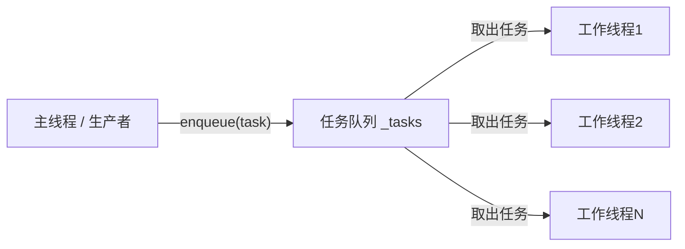
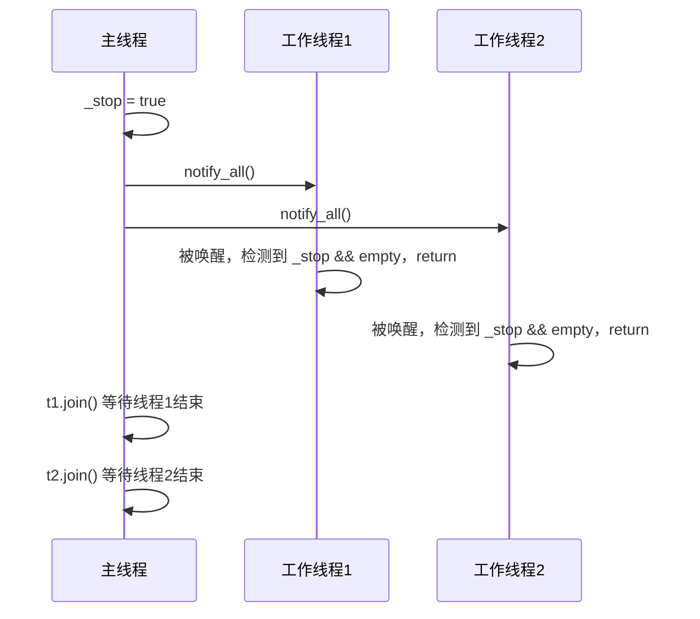
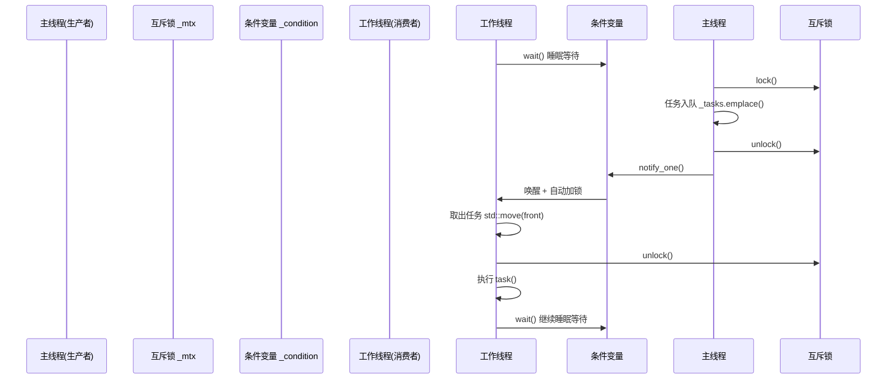

# ThreadPool 构造函数深度解析

> 源码位置：`src/src/merge/src/threadpool.h`

---

## 构造函数全景

```cpp
explicit ThreadPool(size_t ThreadNum, size_t task_max = 10)
    :_stop(false),
    _tasks_max(task_max)
{
    for (size_t i = 0; i < ThreadNum; i++)
    {
        _threads.emplace_back([this] {
            while (true) {
                std::function<void()> task;
                {
                    std::unique_lock<std::mutex> lock(_mtx);
                    _condition.wait(lock, [this] {
                        return !_tasks.empty() || _stop;
                    });
                    if (_stop && _tasks.empty()) return;
                    task = std::move(_tasks.front());
                    _tasks.pop();
                }
                task();
            }
        });
    }
}
```

---

## 第一层：整体架构 —— 生产者-消费者模式

这个构造函数构建的是一个**线程池**，核心思想是经典的生产者-消费者模式：



构造函数只做一件事：**创建 N 个永不停歇的工作线程**，它们在后台不断等待并执行任务。

---

## 第二层：逐行拆解

### 2.1 `explicit` 关键字

```cpp
explicit ThreadPool(size_t ThreadNum, size_t task_max = 10)
```

`explicit` 禁止隐式类型转换。如果没有它：

```cpp
ThreadPool pool = 5;  // 隐式转换：5 → ThreadPool(5)，非常危险！
```

有了 `explicit`，只能显式调用：

```cpp
ThreadPool pool(5);        // ✅ OK
ThreadPool pool(5, 20);    // ✅ OK
ThreadPool pool = ThreadPool(5); // ✅ OK
```

### 2.2 初始化列表

```cpp
:_stop(false),
 _tasks_max(task_max)
```

| 成员 | 类型 | 含义 |
|------|------|------|
| `_stop(false)` | `bool` | 析构信号，`true` 时通知所有线程退出 |
| `_tasks_max(task_max)` | `size_t` | 任务队列容量上限，防止任务无限堆积导致 OOM |

> 这两个值必须在**构造函数体执行之前**初始化好，因为线程 lambda 创建后立即就要读取它们。

### 2.3 `emplace_back` + lambda —— 原地构造线程

```cpp
_threads.emplace_back([this] { ... });
```

等价于：

```cpp
_threads.push_back(std::thread([this] { ... }));
```

区别：`emplace_back` 直接在 `vector` 尾部**原地构造** `std::thread` 对象，少一次移动/拷贝。

`[this]` 捕获当前对象的 `this` 指针，使得 lambda 内部可以访问 `_mtx`、`_tasks`、`_stop` 等私有成员。

---

## 第三层：每个工作线程的生命周期（核心！）

每个线程内部是一个 `while(true)` 死循环，分为四个关键步骤：

### 步骤①：等待任务（阻塞睡眠）

```cpp
std::unique_lock<std::mutex> lock(_mtx);
_condition.wait(lock, [this] {
    return !_tasks.empty() || _stop;
});
```

**这是整个线程池最精妙的点。** 逐句解读：

- `std::unique_lock<std::mutex> lock(_mtx)`：上锁，保证对 `_tasks` 队列的互斥访问。
- `_condition.wait(lock, predicate)` 的语义：
  1. **如果 `predicate` 为 `true`**：立即返回，不阻塞。
  2. **如果 `predicate` 为 `false`**：**原子地**解锁 `_mtx` 并让线程进入睡眠（阻塞在条件变量上），不消耗任何 CPU。
  3. 当被 `notify_one()` 或 `notify_all()` 唤醒后，**自动重新加锁**，再次检查 `predicate`。

因此 `return !_tasks.empty() || _stop;` 的含义是：

> 要么有任务要做，要么该退出了，否则就安心睡觉。

### 步骤②：检查是否退出

```cpp
if (_stop && _tasks.empty()) return;
```

当析构函数设置 `_stop = true` 并 `notify_all()` 后，所有睡眠的线程被唤醒。此时：
- `_stop == true` ✅
- `_tasks.empty() == true` ✅（所有任务已处理完毕）

两个条件同时满足 → 线程 `return` 退出 `while(true)` → lambda 结束 → `std::thread` 生命期结束。

### 步骤③：取出任务（移动语义）

```cpp
task = std::move(_tasks.front());
_tasks.pop();
```

用 `std::move` 而非拷贝，避免 `std::function<void()>` 的潜在深拷贝开销。然后立即 `pop()` 腾出队列空间，让生产者可以继续入队。

### 步骤④：解锁后执行任务

```cpp
}  // ← 这里 lock 的析构函数自动解锁 _mtx
task();  // 在锁外执行任务！
```

**在锁外执行任务是关键设计原则**：

| 做法 | 结果 |
|------|------|
| ❌ 在锁内执行 | 其他线程无法取任务，线程池退化为串行 |
| ✅ 在锁外执行 | 该线程执行任务的同时，其他线程可以继续从队列取任务 |

`{}` 花括号精确控制了 `lock` 的作用域，出作用域自动析构解锁。

---

## 第四层：与析构函数配合

```cpp
~ThreadPool()
{
    {
        std::unique_lock<std::mutex> lock(_mtx);
        _stop = true;          // ① 发出停止信号
    }
    _condition.notify_all();   // ② 唤醒所有睡眠线程
    for (auto& t : _threads)
        t.join();              // ③ 等待每个线程优雅退出
}
```

执行流程：



---

## 第五层：结合 `enqueue` 看完整流程

```cpp
template<typename F, typename... Args>
void enqueue(F&& f, Args&&... args) {
    std::function<void()> task = std::bind(std::forward<F>(f), std::forward<Args>(args)...);
    {
        std::unique_lock<std::mutex> lock(_mtx);
        if (_tasks.size() < _tasks_max)
            _tasks.emplace(std::move(task));
        else {
            std::cout << "function full can't increase!" << std::endl;
            return;
        }
    }
    _condition.notify_one();  // 唤醒一个等待线程
}
```

完整调用时序：



---

## 总结：六大核心要点

| # | 关键点 | 说明 |
|---|--------|------|
| 1 | **条件变量的原子操作** | `wait()` 原子地完成"解锁+睡眠"和"唤醒+加锁"，保证无竞态 |
| 2 | **`[this]` lambda 捕获** | 让线程函数能访问类的所有私有成员 |
| 3 | **锁外执行任务** | 用 `{}` 精确控制锁作用域，任务执行不阻塞其他线程取任务 |
| 4 | **`_stop` 双重检查** | `wait` 的 predicate 检查一次 + `return` 前再检查一次，防止虚假唤醒 |
| 5 | **`std::move` 移动语义** | 任务传递零拷贝，避免 `std::function` 的深拷贝开销 |
| 6 | **`emplace_back` 原地构造** | 直接在容器内构造 `std::thread`，避免额外的移动/拷贝 |

---

## 补充：辅助函数

### `set_thread_as_important` — 设置线程高优先级

```cpp
int set_thread_as_important(int realtime_priority = 10, int nice_value = -10);
```

- 优先尝试 `SCHED_FIFO` 实时调度（需 root 权限）
- 失败则降级为调整 `nice` 值（-20~19，越小优先级越高）
- 返回值：`0`=实时调度成功，`1`=nice调整成功，`-1`=全部失败

### `bind_thread_to_cpu` — 绑定线程到指定 CPU 核心

```cpp
bool bind_thread_to_cpu(int cpu_core);
```

- 将当前线程绑定到指定 CPU 核心，避免核心漂移和缓存失效
- 适用于 CPU 密集型线程

---

## 使用示例

```cpp
#include "threadpool.h"

int main() {
    // 创建4个工作线程，任务队列最大容量20
    Ten::ThreadPool pool(4, 20);

    // 提交任务
    for (int i = 0; i < 10; i++) {
        pool.enqueue([i] {
            std::cout << "Task " << i << " running on thread "
                      << std::this_thread::get_id() << std::endl;
        });
    }

    // pool 析构时自动等待所有任务完成并退出线程
    return 0;
}
```
