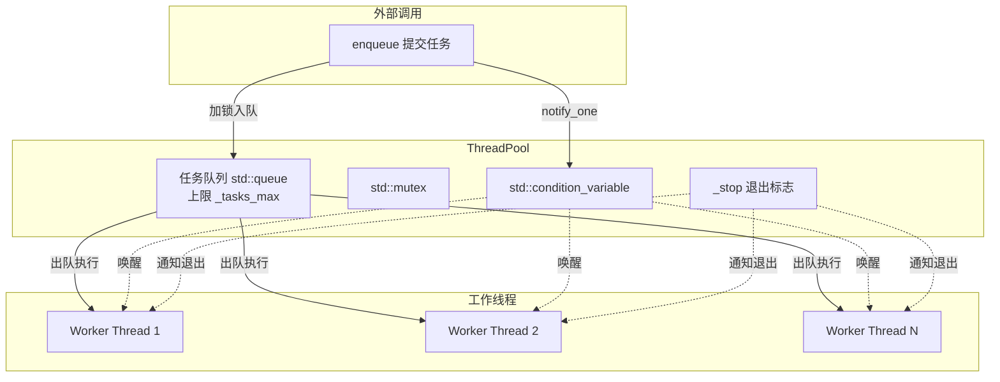

# C++ 多线程管理实战指南

> 基于 `threadpool.h` / `threadpool.cpp` 的工程级多线程管理方案详解

---

## 目录

- [1. C++ 多线程管理概述](#1-c-多线程管理概述)
- [2. 核心概念速览](#2-核心概念速览)
- [3. 源码深度分析](#3-源码深度分析)
  - [3.1 ThreadPool — 通用线程池](#31-threadpool--通用线程池)
  - [3.2 ThreadPool_flag — 安全退出标志](#32-threadpool_flag--安全退出标志)
  - [3.3 set_thread_as_important — 线程优先级](#33-set_thread_as_important--线程优先级)
  - [3.4 bind_thread_to_cpu — CPU 亲和性](#34-bind_thread_to_cpu--cpu-亲和性)
- [4. 实际工程使用指南](#4-实际工程使用指南)
- [5. 常见陷阱与最佳实践](#5-常见陷阱与最佳实践)
- [6. 工程经验总结](#6-工程经验总结)

---

## 1. C++ 多线程管理概述

在机器人、自动驾驶等实时系统中，多线程管理是核心工程问题。C++11 起提供了标准线程库（`<thread>`, `<mutex>`, `<condition_variable>`, `<atomic>`, `<future>`），但在工程实践中还需要解决：

| 问题 | 后果 | 解决方案 |
|------|------|----------|
| 线程频繁创建/销毁 | 性能抖动、延迟不可控 | **线程池**复用 |
| 任务队列无限增长 | 内存耗尽 | 队列上限 + 拒绝策略 |
| 线程无法安全退出 | 程序卡死、资源泄漏 | 退出标志 + `join()` |
| 调度延迟高 | 实时性不满足 | 线程优先级 + CPU 亲和性 |
| 竞态条件 | 数据错乱、偶发崩溃 | `std::mutex` / `std::atomic` |

本文档的两份源码正是一套完整的工程级解决方案。

---

## 2. 核心概念 — 本质与机制

### 2.1 `std::thread` — 内核线程的 RAII 包装

`std::thread` 不创建"用户态协程"，它直接向 OS 申请一个 **内核级线程**（Linux 上即 `clone()` 系统调用产生的轻量级进程）。这意味着：

- 每个 `std::thread` 对应一个独立的 `task_struct`，拥有独立的栈空间（默认 8MB）、寄存器上下文、调度实体
- 构造即启动，析构时若仍 `joinable()` → 直接 `std::terminate`。这是 C++ 标准委员会的选择：不替你决定 join 还是 detach，但也不容忍沉默的资源泄漏

```cpp
std::thread t(f);   // 此时 OS 已创建内核线程，开始执行
t.join();           // 阻塞当前线程，等待 t 的内核线程结束并回收其资源
// t.detach();      // 放弃所有权，内核线程独立运行——但无法再控制它
```

**本质**：`std::thread` 是你向内核申请的一条独立执行流的所有权凭证。销毁凭证前必须明确所有权去向（join 回收 / detach 放弃）。

> **🔰 记住**：`std::thread` 像你雇了一个工人——他已经在干活了。你不说"干完等我"（join）或"不用管你了"（detach），程序直接崩。**永远用 join，不用 detach**。
>
> **⚡ 工程陷阱**：线程函数里如果 `return` 了但主线程没 join，同样崩。更隐蔽的是——线程函数抛了异常没 catch，`std::terminate` 会连带崩掉整个进程。所以线程函数内部一定要 try-catch 所有异常。

---

### 2.2 `std::mutex` — 用户态-内核态混合锁

`std::mutex` 在 Linux 上底层是 `pthread_mutex_t`（futex 机制）。关键点：

- **快速路径（无竞争）**：纯用户态原子操作 CAS 拿锁，不陷入内核。开销 ~25ns
- **慢速路径（有竞争）**：通过 `futex(FUTEX_WAIT)` 陷入内核，线程挂起到等待队列，CPU 不再轮询。被唤醒时 `futex(FUTEX_WAKE)` 返回用户态重新竞争

```cpp
std::mutex mtx;
{
    std::unique_lock<std::mutex> lock(mtx);  // 构造时 lock()，离开作用域自动 unlock()
}   // 这里释放锁——哪怕中间抛异常，RAII 保证锁必被释放
```

**本质**：互斥锁不是让代码"同时执行"，而是创建**串行化点**。锁保护的是一段逻辑的**不变量**——离开临界区时不变量必须处于一致状态。锁和逻辑绑定，而非和数据绑定。

> `std::lock_guard` vs `std::unique_lock`：前者是纯粹的 RAII 锁包装（不可手动 unlock），后者支持 `lock()/unlock()/try_lock()` 和移动语义，配合条件变量必须用后者。

> **🔰 记住**：锁保护的是"一个或多个变量之间的关系"，而不是变量本身。比如 `a = b + 1` 这个操作，如果 b 可能被别的线程改，锁必须包住读 b + 写 a 的整个过程，不能只锁写 a。
>
> **⚡ 工程陷阱**：最常见的死锁模式——线程 A 拿了锁 1 等锁 2，线程 B 拿了锁 2 等锁 1。解法：**所有线程按相同顺序拿锁**。更隐蔽的是回调死锁——你在锁内调了一个外部函数，那个函数内部又尝试拿同一把锁（可重入死锁）。C++ 标准互斥锁不可重入，同一个线程 lock 两次直接死锁。

---

### 2.3 `std::condition_variable` — 等待-唤醒同步原语

条件变量解决的核心问题：**线程如何在不轮询的前提下，等待某个条件成真？**

机制分两步：

1. **等待**：`wait(lock, pred)` 在锁内检查谓词，条件不满足时**原子地**释放锁 + 挂起线程（OS 不再调度它）。两个动作必须原子——否则在释放锁和挂起之间，通知方可能已经改了条件并 notify，导致信号丢失（lost wakeup）
2. **唤醒**：`notify_one()` 挑一个等待线程，`notify_all()` 全部唤醒。被唤醒的线程在 `wait()` 内部重新获取锁，再次检查谓词，通过才返回

```cpp
// 等待方
std::unique_lock<std::mutex> lock(mtx);
cv.wait(lock, [] { return !queue.empty(); });  // 谓词：循环检查 + 防虚假唤醒

// 通知方
{
    std::lock_guard<std::mutex> lock(mtx);
    queue.push(task);
}
cv.notify_one();  // 通知可以在锁外——但必须在条件修改之后
```

**本质**：条件变量 = 一个**等待队列** + 一个**原子释放锁并休眠**的操作。谓词不是可选的——没有谓词，虚假唤醒和信号丢失都会导致逻辑错误。

> **🔰 记住**：条件变量 = "等你准备好叫我"。wait 那边要先拿锁再 wait，notify 那边改完条件再通知。核心口诀：**改条件 → 通知；拿锁 → 检查条件 → 不满足就等**。
>
> **⚡ 工程陷阱**：`notify_one` 在锁内还是锁外？两种都合法，但有细微差别——锁内 notify 被唤醒者立刻竞争锁（通常拿不到，白唤醒），锁外 notify 更高效。但无论如何，**notify 必须在条件修改之后**。另一个常见坑：用 `notify_one` 但多个线程等的条件不同（比如有的等队列非空，有的等队列非满），此时唤醒了不该醒的线程。这种场景用 `notify_all` 或分开的条件变量。

---

### 2.4 `std::atomic<T>` — 无锁的 CPU 指令级原子

`std::atomic` 不经过互斥锁，直接映射到 CPU 的原子指令（x86 上 `LOCK CMPXCHG` / `LOCK XADD`，ARM 上 `LDREX/STREX`）。

核心语义不是"变量不可分割"，而是**内存顺序（memory order）**：

```cpp
std::atomic<bool> flag{false};
flag.store(true, std::memory_order_release);  // 发布：之前的写操作对后续 acquire 可见
bool v = flag.load(std::memory_order_acquire); // 获取：之后读操作能看到 release 前的所有写
```

默认 `memory_order_seq_cst` 最安全但最慢（全序一致，禁止 CPU 乱序）。工程中标志位用默认即可。

**本质**：`atomic` 解决的是 **happens-before 关系**——线程 A 写 atomic 之前的**所有内存写**，对线程 B 读到该 atomic 之后的**所有内存读**可见。这是无锁编程的基石。

> **🔰 记住**：`atomic<bool>` = 多线程安全的 bool，不需要加锁。只适用于**单个变量**的读写。如果是"先读再改"（比如 `if (flag) flag = false`），即使 flag 是 atomic，读和改之间仍可能被其他线程插入——此时需要 `compare_exchange_strong` 或直接上锁。
>
> **⚡ 工程陷阱**：`atomic` 不能替代锁来保护复合操作。`++atomic_int` 是原子的（单条 CPU 指令），但 `if (atomic_int > 0) atomic_int--` 不是——判断和自减之间有窗口。此外，`atomic` 对大的 struct 无效（`std::atomic<T>` 要求 T 是 trivially copyable 且能用 CPU 原子指令处理，通常 ≤ 8 字节）。

---

### 2.5 `std::function` + `std::bind` / Lambda — 可调用对象类型擦除

```cpp
std::function<void()> task = std::bind(&SomeClass::method, &obj, arg1, arg2);
// 等价于：
std::function<void()> task = [&obj, arg1, arg2] { obj.method(arg1, arg2); };
```

**类型擦除**：`std::function<void()>` 内部维护一个虚函数表指针，通过多态存储任意可调用物（函数指针、lambda、bind 结果），只要签名匹配 `void()`。代价是一次虚函数调用的间接跳转（~5ns）。

**完美转发**：`std::forward<Args>(args)...` 保留参数的左值/右值属性，避免不必要的拷贝。`std::bind` 内部按值捕获所有参数，配合 `std::ref` 可实现引用捕获。

**本质**：`std::function` 是把"可调用"这个概念从编译期多态（模板）转为运行期多态（虚函数），让你能把任意函数塞进同一个容器。

> **🔰 记住**：线程池里所有任务都塞进 `std::function<void()>`——不管原本是什么函数签名，bind/lambda 统一转成无参无返回值。
>
> **⚡ 工程陷阱**：lambda 引用捕获 `[&]` 在线程池中是定时炸弹——任务执行时，被引用的局部变量可能早已销毁。线程池任务用 `[=]` 值捕获，或明确列出需要复制的变量。同理，`std::bind` 默认按值捕获，传引用需要用 `std::ref()`。

---

## 3. 源码深度分析

### 3.1 ThreadPool — 通用线程池

**设计目标**：预创建固定数量线程，通过任务队列复用，避免频繁创建/销毁开销。

#### 架构图



#### 核心代码逐段解析

**① 构造函数 — 创建线程**

```cpp
explicit ThreadPool(size_t ThreadNum, size_t task_max = 10)
    :_stop(false), _tasks_max(task_max)
{
    for (size_t i = 0; i < ThreadNum; i++)
    {
        _threads.emplace_back([this] {
            while (true)
            {
                std::function<void()> task;
                {
                    std::unique_lock<std::mutex> lock(_mtx);
                    _condition.wait(lock, [this] {
                        return !_tasks.empty() || _stop;
                    });
                    if (_stop && _tasks.empty()) return;
                    task = std::move(_tasks.front());
                    _tasks.pop();
                }
                task();
            }
        });
    }
}
```

关键设计点：

- **循环取任务**：每个线程在 `while(true)` 中持续等待和执行，永不退出直到析构
- **条件变量等待**：`wait(lock, predicate)` 防止虚假唤醒，在「队列有任务」或「停止」时唤醒
- **优雅退出**：`_stop && _tasks.empty()` — 先处理完积压任务再退出，防止任务丢失
- **锁粒度控制**：任务入队/出队时加锁，**执行 `task()` 时已释放锁**，不阻塞其他线程取任务

**② 析构函数 — 安全关闭**

```cpp
~ThreadPool()
{
    {
        std::unique_lock<std::mutex> lock(_mtx);
        _stop = true;
    }
    _condition.notify_all();   // 唤醒所有等待线程
    for (auto& t : _threads)
        t.join();              // 等待所有线程结束
}
```

> ⚠️ **顺序必须严格**：先设 `_stop` → `notify_all` → 再 `join`。如果在 `notify_all` 之前 `join`，线程可能永远不会被唤醒。

**③ enqueue — 提交任务**

```cpp
template<typename F, typename... Args>
void enqueue(F&& f, Args&&... args)
{
    std::function<void()> task = std::bind(std::forward<F>(f), std::forward<Args>(args)...);
    {
        std::unique_lock<std::mutex> lock(_mtx);
        if (_tasks.size() < _tasks_max)
            _tasks.emplace(std::move(task));
        else {
            std::cout << "function full can't increase!" << std::endl;
            return;  // 背压机制：队列满时直接丢弃
        }
    }
    _condition.notify_one();
}
```

- **完美转发**：`std::forward` 保留参数的值类别（左值/右值），配合可变参数模板支持任意函数签名
- **背压机制**：队列有上限 `_tasks_max`，满了直接丢弃并打印日志（工程实用做法）
- **`notify_one` 而非 `notify_all`**：只唤醒一个线程处理任务，避免「惊群效应」

---

### 3.2 ThreadPool_flag — 安全退出标志

```cpp
class ThreadPool_flag
{
public:
    ThreadPool_flag() : flag_(true) {}

    void set_flag(bool flag) { flag_.store(flag); }
    bool read_flag()  { return flag_.load(); }

private:
    std::atomic<bool> flag_;  // 原子变量，无锁线程安全
};
```

**为什么不用普通 `bool`？**

```cpp
// ❌ 危险：普通 bool 的读写不是原子的，多线程同时访问是未定义行为
bool flag = true;
// 线程A: flag = false;
// 线程B: if (flag) { ... }  // 可能读到中间状态

// ✅ 安全：std::atomic<bool> 保证原子性
std::atomic<bool> flag{true};
flag.store(false);  // 原子写入
bool v = flag.load(); // 原子读取
```

**在项目中的实际用法**（参考 `super2.h` 中的 `set_place()`）：

```cpp
while (Ten::_TREADPOOL_FLAG_.read_flag())  // 外部可随时停止循环
{
    // ... 耗时操作 ...
}
// 在另一线程调用 Ten::_TREADPOOL_FLAG_.set_flag(false) 即可安全终止
```

---

### 3.3 set_thread_as_important — 线程优先级

```cpp
int set_thread_as_important(int realtime_priority = 10, int nice_value = -10);
```

#### 两级降级策略

Linux 内核调度器为每个线程维护一个调度类：

```
SCHED_FIFO（实时）    优先级 1-99，严格抢占，除非阻塞/主动让出，否则一直运行
    ↓ 需要 CAP_SYS_NICE 权限
SCHED_OTHER（CFS）    nice 值 -20~19，按虚拟运行时间 vruntime 比例分配 CPU
```

函数先尝试 SCHED_FIFO，失败后降级调 nice 值。两级都失败则返回 -1。

**本质**：机器人的推理线程是 CPU 密集 + 延迟敏感的——CFS 会在它和其他后台线程间公平分配 CPU，造成推理延迟抖动。设实时优先级就是告诉内核：这条线程比其他线程更重要，优先调度。

#### 使用示例

```cpp
// 在推理线程中调用
void inference_thread_func()
{
    int ret = Ten::set_thread_as_important(50, -10);
    if (ret == -1) {
        // 降级处理：继续运行但延迟可能不达标
    }
    // ... 推理循环 ...
}
```

---

### 3.4 bind_thread_to_cpu — CPU 亲和性

```cpp
bool bind_thread_to_cpu(int cpu_core);
```

#### 本质：阻止调度器在核心间迁移线程

Linux 默认允许线程在任意核心上运行。但每个核心有私有的 L1/L2 缓存——线程迁移后，新核心的缓存是冷的，必须从 L3/内存重新加载数据。

对 YOLO 推理这种反复访问同一批权重矩阵的操作，缓存失效 = 每次推理多 5~20% 延迟。

`pthread_setaffinity_np` 设置 `cpu_set_t` 位掩码，硬限制线程只能在指定核心运行。

#### 使用示例

```cpp
// 将推理线程固定在核心 2 和 3 上（避开系统中断通常占用的核心 0）
void inference_thread_func()
{
    bind_thread_to_cpu(2);  // 或使用两个不同核心分摊负载
    // ... 推理循环 ...
}
```

#### 多线程核心分配策略

```
核心0: 系统中断 + ROS Master
核心1: 相机驱动 + 图像采集
核心2: YOLO ROI12 推理线程
核心3: YOLO CLS 分类线程
核心4: 控制循环 + 后处理
核心5: 日志 + 网络通信
```

---

## 4. 实际工程使用指南

### 4.1 典型工作流程

```cpp
#include "threadpool.h"

// 1. 全局声明（通常在 main 附近）
Ten::ThreadPool pool(4, 20);           // 4 个线程，队列上限 20

// 2. 提交任务
pool.enqueue([](int id) {
    Ten::set_thread_as_important();     // 提升本线程优先级
    Ten::bind_thread_to_cpu(id % 4);    // 绑定到不同核心
    // 执行推理...
}, 0);

// 3. 安全退出（main 结束前）
// ThreadPool 析构函数会自动等待所有任务完成
```

### 4.2 与 super2.h 集成示例

`super2.h` 中的 `set_place()` 函数使用 `_TREADPOOL_FLAG_` 实现外部可控的循环：

```cpp
// super2.h 中的用法
while (Ten::_TREADPOOL_FLAG_.read_flag())
{
    if (sure_1 >= count_1_limit) break;
    // 查找最优候选...
    if (max_place == -1) break;  // 无候选时退出，防止死循环
    // 填充结果...
}
```

配合线程池使用时：

```cpp
// 主控制循环
void control_loop()
{
    Ten::_TREADPOOL_FLAG_.set_flag(true);

    pool.enqueue([] {
        while (Ten::_TREADPOOL_FLAG_.read_flag())
        {
            supper2_.set_roi12_place();
            supper2_.set_cls();
        }
    });

    // 需要停止时
    Ten::_TREADPOOL_FLAG_.set_flag(false);
}
```

### 4.3 线程数量选择

| 任务类型 | 建议线程数 | 原因 |
|----------|-----------|------|
| CPU 密集型（推理） | `核心数 - 1` | 留一个核心给系统 |
| IO 密集型（图像采集） | `核心数 × 2` | IO 等待时可切换 |
| 混合型（本项目） | `4~8` | 4 核推理 + 1 核采集 + 1 核控制 |

### 4.4 调试技巧

```cpp
// 1. 打印线程 ID 确认绑定
std::cout << "Thread " << std::this_thread::get_id()
          << " bound to core " << sched_getcpu() << std::endl;

// 2. 查看线程优先级
int policy;
struct sched_param param;
pthread_getschedparam(pthread_self(), &policy, &param);

// 3. 用 htop 验证
// 终端执行: htop → F2 → Display options → 勾选 "Show custom thread names"
```

---

## 5. 常见陷阱与最佳实践

### 5.1 ❌ 陷阱一：忘记 join 或 detach

```cpp
// ❌ 错误：thread 对象析构时如果还 joinable，调用 std::terminate
{
    std::thread t([] { /* ... */ });
}   // 崩溃！

// ✅ 正确
{
    std::thread t([] { /* ... */ });
    t.join();  // 或 t.detach()
}
```

> **排查方法**：程序突然 `terminate called without an active exception` 且 gdb 指向 `std::thread::~thread()`，就是某处 thread 析构前没 join。

### 5.2 ❌ 陷阱二：条件变量虚假唤醒 + 丢失唤醒

```cpp
// ❌ 危险：无谓词的 wait，虚假唤醒后条件可能仍不满足
cv.wait(lock);

// ❌ 更隐蔽：条件改在 notify 之后
{
    std::lock_guard lock(mtx);
}
cv.notify_one();  // 此时另一线程可能已经 wait 完发现条件不满足又睡了
queue.push(x);    // 条件改了，但没人通知了——**lost wakeup**

// ✅ 安全：用谓词 + 先改条件再通知
{
    std::lock_guard lock(mtx);
    queue.push(x);
}
cv.notify_one();
```

### 5.3 ❌ 陷阱三：锁粒度过大

```cpp
// ❌ 锁持有时间过长，其他线程白白等待
std::lock_guard<std::mutex> lock(mtx);
auto data = queue.front(); queue.pop();
heavy_computation(data);  // 在锁内执行耗时操作！

// ✅ 缩小锁范围
std::function<void()> task;
{
    std::lock_guard<std::mutex> lock(mtx);
    task = std::move(queue.front());
    queue.pop();
}   // 锁在此释放
task();  // 无锁执行
```

### 5.4 ❌ 陷阱四：lambda 引用捕获的悬空引用

**这是线程池中最常见的崩溃原因。**

```cpp
// ❌ 危险：i 和 local_data 在循环结束后就销毁了
for (int i = 0; i < 10; i++) {
    std::vector<int> local_data = {i, i*2};
    pool.enqueue([&] {
        process(local_data);  // 任务执行时 local_data 早已不存在！
    });
}

// ✅ 安全：值捕获（拷贝进 lambda）
for (int i = 0; i < 10; i++) {
    std::vector<int> local_data = {i, i*2};
    pool.enqueue([local_data] {  // 显式按值捕获
        process(local_data);
    });
}
```

> **排查方法**：程序随机段错误，gdb 显示访问的地址在栈区且内容为随机值——大概率是 lambda 悬空引用。

### 5.5 ❌ 陷阱五：不按相同顺序拿锁 → 死锁

```cpp
// ❌ 线程 A：先拿锁1，再拿锁2
// ❌ 线程 B：先拿锁2，再拿锁1
// → 经典 ABBA 死锁

// ✅ 所有线程按全局统一顺序加锁
std::lock(mtx1, mtx2);          // C++11 原子多个锁
std::lock_guard lock1(mtx1, std::adopt_lock);
std::lock_guard lock2(mtx2, std::adopt_lock);
```

### 5.6 ❌ 陷阱六：在锁内调用外部函数 → 隐蔽死锁

```cpp
// ❌ 危险
void ClassA::update() {
    std::lock_guard lock(mtx_);
    callback_();  // 回调内部可能调用 ClassA 的其他方法，再次拿 mtx_
}                 // 而 std::mutex 不可重入 → 死锁

// ✅ 拷贝数据，锁外执行回调
void ClassA::update() {
    Data snapshot;
    {
        std::lock_guard lock(mtx_);
        snapshot = data_;        // 在锁内复制
    }
    callback_(snapshot);         // 锁外执行
}
```

### 5.7 ❌ 陷阱七：`_stop` 不用 atomic

在本项目中 `_stop` 是普通 `bool`，在 `~ThreadPool()` 中由主线程写、工作线程读，看似有竞态条件。但实际上写入时持有 `_mtx`，读取时也持有 `_mtx`，`condition_variable::wait` 的谓词检查在锁内执行——所以受锁保护，安全。

但在无锁场景下，必须用 `std::atomic<bool>`（如 `ThreadPool_flag`）。**经验法则：有锁保护的 bool 用普通 bool，无锁的跨线程 bool 用 atomic。**

### 5.8 ✅ 最佳实践总结

| 原则 | 说明 |
|------|------|
| **RAII 管理锁** | 永远用 `std::unique_lock` / `std::lock_guard`，不用裸 `lock()/unlock()` |
| **最小锁粒度** | 只在访问共享数据时加锁，耗时操作和外部调用放到锁外 |
| **谓词 + 条件变量** | `cv.wait(lock, predicate)`，缺一不可 |
| **先通知再 join** | 析构顺序：设标志 → `notify_all` → `join` |
| **lambda 值捕获** | 线程池任务用 `[=]` 或显式列出变量，不用 `[&]` |
| **固定加锁顺序** | 多锁场景所有线程按同一顺序加锁，或用 `std::lock` 原子加多锁 |
| **队列上限** | 防止内存无限增长，实现背压机制 |
| **atomic 只做标志位** | 简单 bool 标志用 `std::atomic`，复合操作老老实实上锁 |
| **线程亲和性** | CPU 密集型线程绑定固定核心 |
| **优先级分层** | 实时线程用 SCHED_FIFO，普通线程调 nice 值 |

---

## 6. 工程经验总结

### 6.1 多线程程序的启动与停止顺序

这是实际工程中最容易出错的部分。以下是一套经过验证的顺序：

```
启动阶段：
  1. 先创建 ThreadPool（线程开始等待任务）
  2. 设置 _TREADPOOL_FLAG_.set_flag(true)（允许循环执行）
  3. 提交长期任务到线程池
  4. 提交一次性初始化任务

停止阶段（严格按序）：
  1. _TREADPOOL_FLAG_.set_flag(false)  → 通知所有 while 循环退出
  2. 等待业务循环自然结束（可能需要超时保护）
  3. 让 ThreadPool 析构 → 处理完队列中剩余任务 → join 所有线程
  4. 释放其他资源
```

> ⚠️ 最常见的错误：在 flag 置 false 之前就析构了线程池 → 工作线程还在 `while(flag)` 里等，但 ThreadPool 析构会 join → 卡死。

### 6.2 任务超时保护

```cpp
// 包装 enqueue，增加超时 future
template<typename F, typename... Args>
auto enqueue_with_timeout(F&& f, Args&&... args)
    -> std::future<decltype(f(args...))>
{
    using ReturnType = decltype(f(args...));
    auto task = std::make_shared<std::packaged_task<ReturnType()>>(
        std::bind(std::forward<F>(f), std::forward<Args>(args)...)
    );
    std::future<ReturnType> future = task->get_future();
    enqueue([task] { (*task)(); });
    return future;
}

// 使用
auto fut = pool.enqueue_with_timeout(heavy_task, data);
if (fut.wait_for(std::chrono::milliseconds(500)) == std::future_status::timeout) {
    std::cout << "Task timeout!" << std::endl;
    // 注意：任务仍在执行，无法强制取消。需要配合 flag 让任务自己检查退出
}
```

### 6.3 排查多线程问题的三板斧

| 症状 | 首先检查 | 工具 |
|------|----------|------|
| 程序卡死不退出 | 析构顺序：flag → notify → join 是否正确 | `gdb attach` → `thread apply all bt` |
| 随机段错误 | lambda 是否用了 `[&]` 引用捕获 | AddressSanitizer（`-fsanitize=address`） |
| 数据偶尔错乱 | 是否有共享变量没加锁 / 锁的范围不够 | ThreadSanitizer（`-fsanitize=thread`） |
| 延迟抖动 | 调度策略和 CPU 亲和性是否设置 | `htop` / `perf sched record` |
| 推理结果不一致 | 是否有多线程共写同一块内存（如 cv::Mat） | 检查所有非 const 引用参数 |

### 6.4 本项目的最佳组合方式

基于 `threadpool.h` 和 `threadpool.cpp`，一个机器人视觉线程的最佳启动代码：

```cpp
void start_vision_worker(Ten::ThreadPool& pool, int core_id) {
    pool.enqueue([core_id] {
        // 1. 设置调度属性
        Ten::set_thread_as_important(50, -10);
        Ten::bind_thread_to_cpu(core_id);

        // 2. 值捕获所需对象（或确保对象生命周期 > 线程生命周期）
        // auto& supper = GetSupperInstance();  // 单例，安全

        // 3. 可中断的主循环
        while (Ten::_TREADPOOL_FLAG_.read_flag()) {
            // 推理 + 后处理
            // 每个循环内部自己处理异常，不要让异常逃逸到线程顶层
            try {
                // ... 业务逻辑 ...
            } catch (const std::exception& e) {
                std::cerr << "[Error] vision worker: " << e.what() << std::endl;
                // 决定：继续运行 / break 退出
            }
        }
        std::cout << "[Info] vision worker on core " << core_id << " stopped." << std::endl;
    });
}
```

### 6.5 一句话经验

| 场景 | 一句话 |
|------|--------|
| 选锁还是 atomic | 改一个变量用 atomic，改两个变量之间的关系用锁 |
| 要不要用线程池 | 任务执行时间 > 线程创建时间的 10 倍以上 → 用线程池 |
| 线程池多大 | CPU 密集型 = 核心数；IO 密集型 = 核心数 × 2；不确定先设 4 |
| detach 还是 join | 永远 join |
| notify 放锁内还是锁外 | 锁外效率高，锁内也没错，但先改条件再通知是铁律 |
| 什么时候用条件变量 | 需要"等待某个条件"而不是"轮询某个条件"的时候 |

---

## 附录：文件索引

| 文件 | 内容 |
|------|------|
| `threadpool.h` | 线程池 `ThreadPool`、退出标志 `ThreadPool_flag`、优先级/亲和性函数声明 |
| `threadpool.cpp` | `set_thread_as_important()` 和 `bind_thread_to_cpu()` 的实现 |
| `super2.h` | 实际使用 `_TREADPOOL_FLAG_` 进行安全退出控制的业务代码 |

---

> 📌 这份代码是机器人实时视觉系统的一部分，所有设计都围绕 **"高吞吐、低延迟、安全退出"** 三个目标。理解了这套模式，就能应对绝大多数 C++ 工程中的多线程管理问题。
