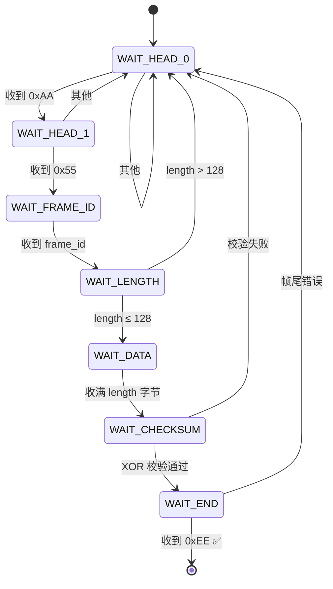
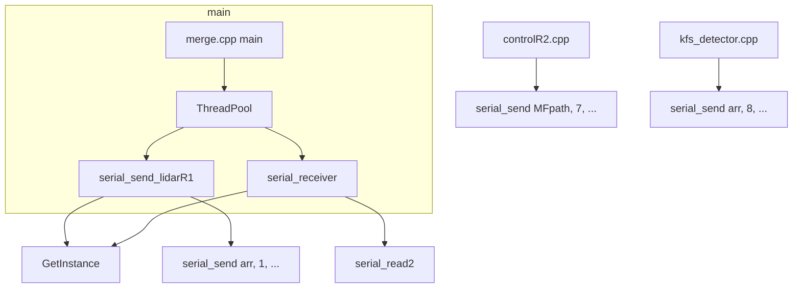
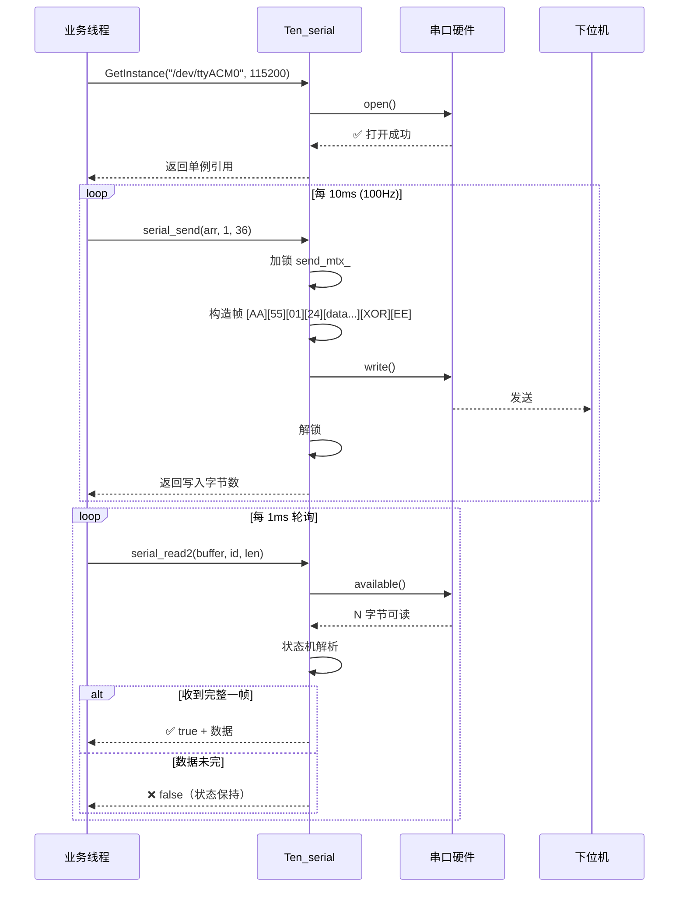

# Ten::Ten_serial 串口通信模块详解

> 基于 ROS + `serial` 库的 C++ 串口通信封装，采用 **单例模式** + **自定义帧协议**，适用于机器人上下位机通信。

---

## 目录

1. [文件结构](#1-文件结构)
2. [设计思想](#2-设计思想)
3. [核心 API 详解](#3-核心-api-详解)
4. [自定义帧协议](#4-自定义帧协议)
5. [状态机接收（serial_read2）](#5-状态机接收-serial_read2)
6. [项目中的引用与用法](#6-项目中的引用与用法)
7. [学习路线与最佳实践](#7-学习路线与最佳实践)
8. [常见问题与调试](#8-常见问题与调试)

---

## 1. 文件结构

```
src/merge/src/
├── serial.h              # 头文件：类声明、帧协议宏、状态机枚举
├── serial.cpp            # 实现文件：所有成员函数实现
├── parameter/
│   └── parameter.h       # 全局参数（含 _max_serial_num_ 等）
└── threadpool.h          # 线程池（配合串口多线程使用）
```

### 依赖关系

```mermaid
graph LR
    A[serial.h] --> B[serial::Serial (第三方库)]
    A --> C[parameter.h]
    A --> D[threadpool.h]
    E[serial.cpp] --> A
    F[业务代码] --> A
```

---

## 2. 设计思想

### 2.1 单例模式 (Singleton)

整个进程**只有一个** `Ten_serial` 实例，所有线程共享同一个串口对象：

```cpp
// 获取实例（唯一方式）
Ten::Ten_serial& serial = Ten::Ten_serial::GetInstance("/dev/ttyACM0", 115200);
```

**特点：**
- 构造函数是 `private`，外部不能 `new`
- 使用 `std::call_once` 保证**线程安全的一次性初始化**
- 使用 `std::unique_ptr` 自动管理内存，无需手动 `delete`

### 2.2 为什么用单例？
- 机器人只有一个物理串口，不需要多个对象
- 多线程环境下共享串口资源，避免重复打开
- 统一管理串口状态（开/关/异常恢复）

### 2.3 线程安全
- 发送 `send_mtx_` 和接收 `read_mtx_` **分别加锁**，收发互不阻塞
- `std::call_once` 保证 `GetInstance` 线程安全
- `std::lock_guard` RAII 锁，异常安全

---

## 3. 核心 API 详解

### 3.1 `GetInstance()` — 获取单例

```cpp
static Ten_serial& GetInstance(
    const std::string& port = "/dev/ttyACM0",
    const size_t& serial_baud = 115200
);
```

| 参数 | 说明 | 默认值 |
|------|------|--------|
| `port` | 串口设备路径 | `/dev/ttyACM0` |
| `serial_baud` | 波特率 | `115200` |

**首次调用时**初始化串口（循环重试直到打开成功），**之后返回同一个实例**。

### 3.2 `serial_send()` — 发送数据

```cpp
size_t serial_send(void* p, uint8_t frame_id, uint8_t length);
```

| 参数 | 说明 | 示例 |
|------|------|------|
| `p` | 要发送的数据缓冲区指针 | `float arr[4]` |
| `frame_id` | 帧ID（标识数据类型） | `1`=位姿, `6`=AprilTag, `7`=路径, `8`=KFS标志 |
| `length` | 数据长度（字节数） | `sizeof(arr)` |

**返回值：** 实际写入的字节数，失败返回 `0`。

**示例：**
```cpp
// 发送 4 个 float（x, y, z, yaw），帧ID=1
float arr[4] = {1.0, 2.0, 3.0, 0.5};
serial.serial_send(arr, 1, sizeof(arr));  // length = 16 字节
```

**内部流程：**
```
[0xAA][0x55][frame_id][length][data...][XOR校验][0xEE]
  帧头1  帧头2     ID     数据长度  数据   校验和    帧尾
```

### 3.3 `serial_read()` — 简单接收

```cpp
bool serial_read(void* p, uint8_t& received_frame_id, uint8_t& received_length);
```

| 参数 | 说明 |
|------|------|
| `p` (out) | 接收到的数据存放地址 |
| `received_frame_id` (out) | 收到的帧ID |
| `received_length` (out) | 收到的数据长度 |

**特点：**
- 从缓冲区**逐字节扫描**，遇到完整帧就返回
- **非阻塞**：无数据时立即返回 `false`
- 单次只解析一帧，适合高频轮询

### 3.4 `serial_read2()` — 状态机增强接收 ⭐

```cpp
bool serial_read2(void* p, uint8_t& received_frame_id, uint8_t& received_length);
```

**与 `serial_read()` 的核心区别：**

| 特性 | `serial_read()` | `serial_read2()` |
|------|----------------|------------------|
| 解析方式 | 循环扫描，每次都从头开始 | **状态机**，从上次断点继续 |
| 抗干扰 | 弱（半帧数据会丢失） | 强（可续传） |
| 适用场景 | 低频、数据稳定 | **高频、数据流可能断续** |
| 状态保持 | 无 | 用 `read_state_` 保存进度 |

**状态机流转：**
```
WAIT_HEAD_0 → WAIT_HEAD_1 → WAIT_FRAME_ID → WAIT_LENGTH → WAIT_DATA → WAIT_CHECKSUM → WAIT_END → ✅ 完成
    ↑              ↑              ↑               ↑            ↑              ↑              ↑
    └───── 任何一步失败，回到 WAIT_HEAD_0，等待下一帧 ─────┘
```

**示例：**
```cpp
double arr[10] = {0};
uint8_t frame_id = 0, length = 0;
if (serial.serial_read2(arr, frame_id, length)) {
    // 成功收到一帧
    std::cout << "id: " << (int)frame_id << std::endl;
    std::cout << "x = " << arr[0] << std::endl;
}
```

### 3.5 `clearBuffer()` — 清空缓冲区

```cpp
bool clearBuffer(int clear_type = 0);
```

| `clear_type` | 含义 |
|:---:|------|
| `0` | 清空接收 + 发送缓冲区（默认） |
| `1` | 仅清空接收缓冲区 |
| `2` | 仅清空发送缓冲区 |

**典型用途：** 串口刚打开时，清除上电残留的脏数据。

### 3.6 `isOpen()` — 检查串口状态

```cpp
bool isOpen() const;
```

---

## 4. 自定义帧协议

### 4.1 帧格式

```
┌────────┬────────┬──────────┬────────┬──────────┬──────────┬────────┐
│ 0xAA   │ 0x55   │ frame_id │ length │ data[]   │ checksum │ 0xEE   │
│ 帧头1  │ 帧头2  │ 帧ID     │ 数据长 │ 数据段   │ XOR校验  │ 帧尾   │
│ 1 byte │ 1 byte │ 1 byte   │ 1 byte │ N bytes  │ 1 byte   │ 1 byte │
└────────┴────────┴──────────┴────────┴──────────┴──────────┴────────┘
```

**帧长度公式：** `N + 6` 字节（N = 数据段长度）

### 4.2 校验方式 — XOR（异或校验）

```cpp
int calculateXORcheck(const uint8_t* data, size_t length) {
    uint8_t checksum = 0;
    for (size_t i = 0; i < length; i++) {
        checksum ^= data[i];
    }
    return checksum;
}
```

**特点：** 实现简单、计算快、能检测奇数位错误，适合嵌入式实时通信。

### 4.3 项目中使用的帧ID约定

| frame_id | 含义 | 数据格式 | 所在文件 |
|:--------:|------|----------|----------|
| `1` | 雷达定位位姿 (x,y,z,roll,pitch,yaw,vel) | `float[9]` 或 `float[4]` | `debug/control.cpp`, `debug/merge_func.cpp` |
| `6` | AprilTag 视觉定位 (x,y,z,yaw) | `float[4]` | `apriltag/apriltag.cpp`（声明） |
| `7` | 地图路径数据 | `uint8_t[]` | `superstratum/controlR2.cpp` |
| `8` | KFS 检测结果标志 | `uint8_t[1]` | `kfs_detector/kfs_detector.cpp` |
| `9` | 参数配置数据 | `uint8_t[]` | `superstratum/controlR1.cpp`（注释掉） |

---

## 5. 状态机接收（serial_read2）深度解析

### 5.1 为什么需要状态机？

串口是**流式**协议，数据可能在任何位置断开：

- 发送方发了 `[AA][55][01][04][...data...][chk][EE]`
- 接收方可能先收到 `[55][01][04]`（中间加入读操作）

普通方法会错过帧头，导致整帧丢失。**状态机记住上次解析到哪里了**，下次继续。

### 5.2 状态迁移图



### 5.3 关键设计要点

1. **`rx_buffer_` + `rx_index_`** — 数据缓冲区和写入位置，支持续传
2. **`target_length_`** — 当前帧期望的数据长度，用于判断数据是否收齐
3. **异常安全** — `catch (...)` 重置状态机到 `WAIT_HEAD_0`
4. **非阻塞** — `while (serial_.available() > 0)` 读完缓冲区就返回

---

## 6. 项目中的引用与用法

### 6.1 文件引用总览

| 文件 | 引用方式 | 用途 |
|------|----------|------|
| `serial.cpp` | `#include "serial.h"` | 实现文件 |
| `apriltag/apriltag.cpp` | `#include "../serial.h"` | AprilTag 位姿串口发送（声明未实现） |
| `debug/control.cpp` | `#include "./../serial.h"` | `serial_send_lidarR1()` / `serial_send_lidarR2()` — 雷达位姿发送 |
| `debug/debug_vision.cpp` | `#include "./../serial.h"` | `test_receiver()` — 串口接收测试 |
| `debug/merge_func.cpp` | `#include "./../serial.h"` | 同上，另一份雷达位姿发送 |
| `debug/test.cpp` | `#include "serial.h"` | 测试文件 |
| `kfs_detector/kfs_detector.cpp` | `#include "./../serial.h"` | 检测到 KFS 后串口发标志 |
| `superstratum/controlR1.cpp` | 间接（通过 `.h`） | 参数下发 |
| `superstratum/controlR2.cpp` | 间接（通过 `.h`） | 地图路径下发 |
| `log/logger.h` | 注释中有引用 | （未实际使用） |

### 6.2 典型用法模式

#### 模式 A：发送定位数据（最常用）

```cpp
// 文件：debug/control.cpp  serial_send_lidarR1()
void serial_send_lidarR1() {
    urcu_memb_register_thread();              // 1. RCU 线程注册
    Ten::Ten_serial& serial = Ten::Ten_serial::GetInstance();  // 2. 获取串口单例
    float arr[9] = {0};
    
    ros::Rate sl(100);                         // 3. 100Hz 循环
    while (Ten::_TREADPOOL_FLAG_.read_flag()) {
        // ... 计算位姿 ...
        arr[0] = x; arr[1] = y; arr[2] = z;
        arr[3] = roll; arr[4] = pitch; arr[5] = yaw;
        arr[6] = vx; arr[7] = vy; arr[8] = vz;
        
        serial.serial_send(arr, 1, sizeof(arr));  // 4. 发送
        sl.sleep();
    }
    urcu_memb_unregister_thread();
}
```

#### 模式 B：接收数据（串口读取）

```cpp
// 文件：debug/debug_vision.cpp  test_receiver()
void test_receiver() {
    urcu_memb_register_thread();
    Ten::Ten_serial& serial = Ten::Ten_serial::GetInstance();
    
    while (Ten::_TREADPOOL_FLAG_.read_flag()) {
        double arr[10] = {0};
        uint8_t frame_id = 0, length = 0;
        if (serial.serial_read2(arr, frame_id, length)) {
            std::cout << "id: " << (int)frame_id << std::endl;
            printf("dt = %.15lf\n", now - arr[0]);
        }
        usleep(1000);  // 1ms 轮询
    }
    urcu_memb_unregister_thread();
}
```

#### 模式 C：发送控制指令

```cpp
// 文件：superstratum/controlR2.cpp
uint8_t MFpath[30];
// ... 填充路径数据 ...
serial.serial_send(MFpath, 7, length);  // frame_id=7，发送路径
```

#### 模式 D：发送标志信号

```cpp
// 文件：kfs_detector/kfs_detector.cpp
uint8_t arr[1] = {1};
serial.serial_send(arr, 8, 1);  // frame_id=8，发送 1 字节标志
```

### 6.3 典型调用链



---

## 7. 学习路线与最佳实践

### 7.1 学习路线

```
第1步：理解单例模式
  → 学习 GetInstance() 和 std::call_once
  → 理解为什么不能直接 new Ten_serial

第2步：掌握帧协议
  → 理解 [AA][55][ID][LEN][DATA][XOR][EE] 结构
  → 学会手动构造和解析一帧数据

第3步：用 serial_send 发送数据
  → 写一个小程序，发一个 float 数组
  → 用串口助手（如 CuteCom）在 PC 端查看

第4步：用 serial_read2 接收数据
  → 理解状态机 7 个状态
  → 用两个设备对发测试

第5步：多线程串口通信
  → 一个线程发、一个线程收
  → 理解发送锁和接收锁为什么分开
```

### 7.2 最佳实践

#### ✅ 发送端

```cpp
// ✅ 正确：用 sizeof 获取字节数
float data[4] = {x, y, z, yaw};
serial.serial_send(data, 1, sizeof(data));

// ❌ 错误：length 传成数组元素个数
serial.serial_send(data, 1, 4);  // 应该传 16！
```

#### ✅ 接收端

```cpp
// ✅ 正确：先声明输出变量
uint8_t frame_id, length;
uint8_t buffer[128];
if (serial.serial_read2(buffer, frame_id, length)) {
    // 用 frame_id 判断数据类型
    switch (frame_id) {
        case 1: /* 位姿数据 */ break;
        case 7: /* 路径数据 */ break;
    }
}
```

#### ✅ 异常处理

```cpp
// 发送函数内部已有异常捕获 + 自动重连 init_serial()
// 调用方不需要额外 try-catch
serial.serial_send(data, 1, sizeof(data));
```

#### ✅ 初始化时机

```cpp
// 在进程启动时尽早调用 GetInstance()
// 构造函数会循环重试直到串口打开
// 避免在回调函数中第一次调用（延迟不可控）
```

### 7.3 调试技巧

```bash
# 1. 查看串口设备
ls -l /dev/ttyACM* /dev/ttyUSB*

# 2. 查看串口权限（需要 dialout 组）
ls -l /dev/ttyACM0
sudo usermod -a -G dialout $USER  # 添加权限后需注销重登

# 3. 用 CuteCom 或 screen 测试
sudo apt install cutecom
cutecom &
# 设置: 波特率 115200, 8N1, 无流控

# 4. 查看串口是否被占用
sudo lsof /dev/ttyACM0

# 5. 启用低延迟模式（代码中自动调用 set_low_latency）
# 通过 ioctl ASYNC_LOW_LATENCY 标志位减少 USB 串口延迟
```

---

## 8. 常见问题与调试

### Q1: 串口打不开？

**可能原因：**
- 设备路径不对：`/dev/ttyACM0` vs `/dev/ttyUSB0`
- 权限不足：未加入 `dialout` 组
- 设备被占用：另一个进程在使用
- USB 转串口松动

**解决方案：**
```cpp
// serial.cpp 中 init_serial() 会尝试遍历
// 从 /dev/ttyACM0 到 /dev/ttyACM{_max_serial_num_}
// _max_serial_num_ 在 parameter.h 中定义
```

### Q2: 数据接收乱码/丢帧？

- 检查波特率是否匹配（上下位机必须一致）
- 优先使用 `serial_read2()` 状态机版本
- 检查帧 ID 和 length 是否匹配
- 用 `clearBuffer()` 清空首次上电的脏数据

### Q3: 发送返回 0？

- 串口已断开 → 代码自动调用 `init_serial(port_)` 重连
- 检查 `p` 指针是否为空
- 检查 `length` 值是否为 0

### Q4: 多线程冲突？

- 发送用 `send_mtx_`，接收用 `read_mtx_`，互不干扰
- 如果线程间需要同步数据，额外加业务锁（如 `std::atomic`）

### Q5: `this == nullptr` 检查？

```cpp
if (this == nullptr) return false;  // 防止野指针调用
```

这是一种**防御性编程**。正常 C++ 中 `this` 不会为 `nullptr`，但某些极端情况（如通过空指针调用成员函数）可能发生。这是一个**安全兜底**。

---

## 附录 A: 序列图 — 一次完整通信



---

## 附录 B: 快速开始模板

```cpp
#include "serial.h"

int main() {
    // 1. 获取串口实例（自动初始化）
    Ten::Ten_serial& serial = Ten::Ten_serial::GetInstance("/dev/ttyACM0", 115200);

    // 2. 检查是否打开
    if (!serial.isOpen()) {
        std::cerr << "串口打开失败！" << std::endl;
        return -1;
    }

    // 3. 清空缓冲区（首次上电推荐）
    serial.clearBuffer(1);  // 清空接收缓冲区

    // 4. 发送数据
    float pose[4] = {1.0, 2.0, 3.0, 0.5};
    size_t sent = serial.serial_send(pose, 1, sizeof(pose));
    std::cout << "发送 " << sent << " 字节" << std::endl;

    // 5. 接收数据
    uint8_t buffer[128];
    uint8_t frame_id = 0, length = 0;
    if (serial.serial_read2(buffer, frame_id, length)) {
        std::cout << "收到帧 ID=" << (int)frame_id 
                  << " 长度=" << (int)length << std::endl;
    }

    return 0;
}
```
