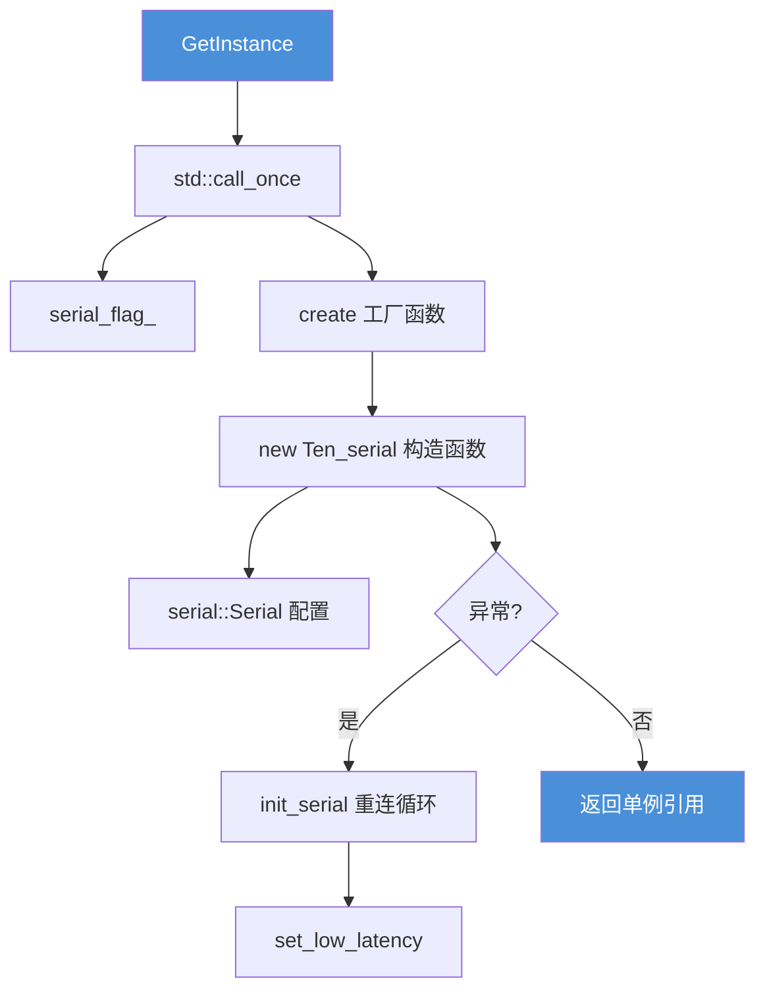
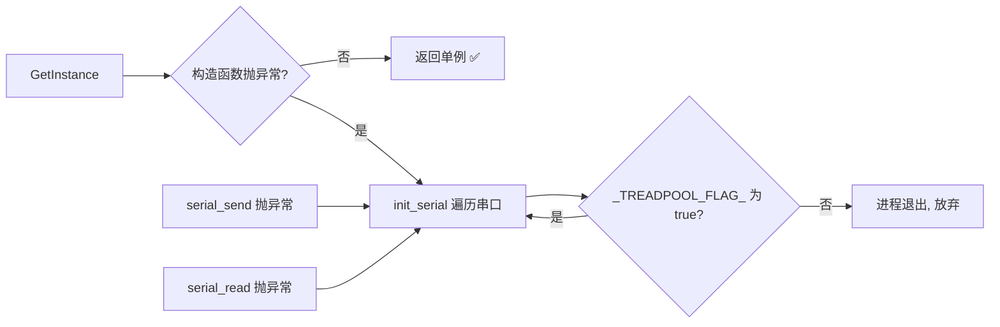

# `Ten_serial::GetInstance` 深度解析

> 本文档专注分析 `GetInstance` 这个单例入口函数——它调用了哪些 API、依赖了哪些数据结构、初始化链路是怎样的。

---

## 1. 函数签名与位置

```cpp
// serial.h (public 区)
static Ten_serial& GetInstance(
    const std::string& port = "/dev/ttyACM0",
    const size_t& serial_baud = 115200
);
```

```cpp
// serial.cpp (实现)
Ten_serial& Ten_serial::GetInstance(const std::string& port, const size_t& serial_baud)
{
    static std::unique_ptr<Ten_serial> ten_serial = nullptr;
    std::call_once(serial_flag_, [port, serial_baud]() 
    {
        ten_serial = create(port, serial_baud);
        std::cout << "init_serial" << std::endl;
    });
    return *ten_serial;
}
```

---

## 2. 调用链全景



---

## 3. 调用的 API 详解

### 3.1 `std::call_once` — C++11 线程安全的一次性调用

```cpp
#include <mutex>  // std::call_once, std::once_flag

static std::once_flag serial_flag_;  // 类内静态成员
std::call_once(serial_flag_, lambda);
```

| 特性 | 说明 |
|------|------|
| **作用** | 保证 lambda 在整个程序生命周期中**只执行一次** |
| **线程安全** | 多个线程同时调用 `GetInstance`，只有一个能进入初始化 |
| **异常安全** | 如果 lambda 抛异常，`serial_flag_` 会**重置**，下次调用会重试 |
| **对比 double-check** | `call_once` 是标准库提供的原语，比手写双重检查锁更可靠 |

> **项目中声明位置：** `static std::once_flag serial_flag_;` — 在 `serial.h` 的 `private` 区声明，在 `serial.cpp` 的命名空间作用域定义。

### 3.2 `create()` — 私有的静态工厂函数

```cpp
// serial.h private 区
static std::unique_ptr<Ten_serial> create(
    const std::string& port = "/dev/ttyACM0",
    const size_t& serial_baud = 115200
) {
    return std::unique_ptr<Ten_serial>(new Ten_serial(port, serial_baud));
}
```

| 特性 | 说明 |
|------|------|
| **为什么存在？** | 构造函数是 `private`，外部无法 `new`。`create` 是静态成员，可以访问私有构造函数 |
| **返回值** | `std::unique_ptr<Ten_serial>` — RAII 智能指针，无需手动 `delete` |
| **为什么不用 `std::make_unique`？** | `make_unique` 无法访问私有构造函数（它是外部函数）。`new` + `unique_ptr` 构造函数是标准做法 |

### 3.3 `Ten_serial` 构造函数 — 核心初始化

```cpp
Ten_serial(const std::string& port, const size_t& serial_baud);
```

构造函数内部调用了 **`serial::Serial` 库的 8 个 API**：

#### `serial::Serial` 配置 API 一览

| 调用顺序 | API | 作用 | 当前值 |
|:--------:|-----|------|--------|
| 1 | `serial_.setPort(port)` | 设置串口设备路径 | 传入的 `port`（如 `/dev/ttyACM0`） |
| 2 | `serial_.setBaudrate(serial_baud)` | 设置波特率 | 传入的 `serial_baud`（默认 `115200`） |
| 3 | `serial_.setFlowcontrol(serial::flowcontrol_none)` | 流控制 | **无**（无 RTS/CTS/XON/XOFF） |
| 4 | `serial_.setParity(serial::parity_none)` | 校验位 | **无校验**（8N1 的一部分） |
| 5 | `serial_.setStopbits(serial::stopbits_one)` | 停止位 | **1 位**（8N1 的一部分） |
| 6 | `serial_.setBytesize(serial::eightbits)` | 数据位 | **8 位**（8N1 的一部分） |
| 7 | `serial_.setTimeout(time_out)` | 超时 | `simpleTimeout(100)` — 100ms |
| 8 | `serial_.open()` | **打开串口** | 阻塞直到成功或循环继续 |

> **串口参数总结：`115200, 8N1, 无流控, 100ms 超时`**

#### `serial::Timeout::simpleTimeout(100)` 详解

```cpp
serial::Timeout time_out = serial::Timeout::simpleTimeout(100);
```

`simpleTimeout` 是 `serial` 库提供的辅助函数，等价于：

```cpp
Timeout(100, 100, 0, 100, 0);
// 即: {inter_byte_timeout=100ms, read_timeout_constant=100ms, ...}
```

#### 构造函数中的异常处理

```cpp
try {
    // ... 上述配置 + serial_.open() ...
} catch(const std::exception& e) {
    // 初始化失败 → 进入重连循环
    while(!init_serial(port_) && Ten::_TREADPOOL_FLAG_.read_flag()) {
        usleep(100000);  // 100ms 重试一次
    }
}
catch(...) {
    // 同上
}
```

---

### 3.4 `init_serial()` — 重连/自动遍历串口

```cpp
bool init_serial(const std::string& port, const size_t& serial_baud = 115200);
```

此函数在**构造函数异常**或**发送/接收异常**时被调用。

#### 关键逻辑

```cpp
static char number = '0';
static int i = 0;

std::string ports = port + std::string(1, number + i);
// port = "/dev/ttyACM" (注意构造函数中 pop_back 去掉了末尾数字)
// i=0 → "/dev/ttyACM0"
// i=1 → "/dev/ttyACM1"
// ...
```

| 特性 | 说明 |
|------|------|
| **自动遍历** | 从 `xxx0` 开始尝试，失败后 `i++`，直到 `_max_serial_num_` |
| **`_max_serial_num_`** | 定义在 `parameter.h`，从 YAML 配置文件读取，默认 10 |
| **调用 `set_low_latency()`** | 打开成功后设置 USB 串口低延迟模式 |
| **失败策略** | `i` 循环到 `_max_serial_num_` 后归零，继续轮询 |

#### 过程中调用的 API

| API | 用途 |
|-----|------|
| `serial_.close()` | 关闭当前（可能已断开的）串口 |
| `serial_.setPort(ports)` | 设置新的设备路径 |
| `serial_.setBaudrate(...)` | 同上构造函数 |
| `serial_.setFlowcontrol(...)` | 同上 |
| `serial_.setParity(...)` | 同上 |
| `serial_.setStopbits(...)` | 同上 |
| `serial_.setBytesize(...)` | 同上 |
| `serial_.setTimeout(...)` | 同上 |
| `serial_.open()` | 尝试打开 |
| `serial_.isOpen()` | 检查状态 |
| `serial_.getPort()` | 获取当前端口名（`set_low_latency` 中调用） |

### 3.5 `set_low_latency()` — Linux USB 串口低延迟

```cpp
bool set_low_latency();
```

> **作用：** 通过 Linux `ioctl` 系统调用，设置 USB 串口的 `ASYNC_LOW_LATENCY` 标志，**减少 USB 串口的数据延迟**（从默认的 16ms 减少到接近实时）。

#### 调用的系统 API

| API | 头文件 | 作用 |
|-----|--------|------|
| `open()` | `<fcntl.h>` | 打开设备文件获取文件描述符（`O_RDWR \| O_NOCTTY \| O_NONBLOCK`） |
| `ioctl(fd, TIOCGSERIAL, &ser_info)` | `<sys/ioctl.h>` | 获取当前串口信息结构体 |
| `ioctl(fd, TIOCSSERIAL, &ser_info)` | `<sys/ioctl.h>` | 设置修改后的串口信息结构体 |
| `close(fd)` | `<unistd.h>` | 关闭临时文件描述符 |
| `strerror(errno)` | `<cstring>` | 将错误码转为可读字符串 |

#### 数据结构

```cpp
struct serial_struct ser_info;  // 定义在 <linux/serial.h>
ser_info.flags |= ASYNC_LOW_LATENCY;  // 设置低延迟标志
```

---

## 4. 涉及的数据结构

### 4.1 类内成员（`serial.h` private 区）

| 成员 | 类型 | 作用 |
|------|------|------|
| `serial_` | `serial::Serial` | **第三方库核心对象**，封装了 Linux `termios` 串口操作 |
| `port_` | `std::string` | 存储串口路径**前缀**（构造函数中去掉末尾数字，如 `"/dev/ttyACM"`） |
| `send_mtx_` | `std::mutex` | 发送互斥锁 |
| `read_mtx_` | `std::mutex` | 接收互斥锁 |
| `serial_flag_` | `static std::once_flag` | 保证 `GetInstance` 只初始化一次 |

### 4.2 静态局部变量（`serial.cpp`）

| 变量 | 类型 | 作用域 | 作用 |
|------|------|--------|------|
| `ten_serial` | `static std::unique_ptr<Ten_serial>` | `GetInstance` 函数内 | 持有唯一实例的智能指针 |

### 4.3 `init_serial` 静态局部变量

| 变量 | 类型 | 作用 |
|------|------|------|
| `number` | `static char` | 起始字符 `'0'`，用于拼接端口号 |
| `i` | `static int` | 当前尝试的端口号偏移量 |

### 4.4 外部依赖（跨文件）

| 符号 | 类型 | 定义位置 | 作用 |
|------|------|----------|------|
| `_max_serial_num_` | `extern int` | `parameter.h` → YAML 配置 | 最多遍历的串口数量 |
| `_TREADPOOL_FLAG_` | `extern ThreadPool_flag` | `threadpool.h` | 全局线程池运行标志（`std::atomic<bool>` 封装） |

#### `ThreadPool_flag` 类

```cpp
class ThreadPool_flag {
public:
    void set_flag(bool flag);    // flag_.store(flag)
    bool read_flag();            // return flag_.load()
private:
    std::atomic<bool> flag_;     // 原子布尔，默认 true
};
```

构造函数异常时的重连循环依赖 `_TREADPOOL_FLAG_.read_flag()` 来判断是否继续尝试：

```cpp
while(!init_serial(port_) && Ten::_TREADPOOL_FLAG_.read_flag()) {
    usleep(100000);  // 进程未退出就继续重试
}
```

---

## 5. 完整调用序列（从 `GetInstance` 到串口就绪）

```
用户代码
  │
  ├─► Ten::Ten_serial::GetInstance("/dev/ttyACM0", 115200);
  │
  ├─► std::call_once(serial_flag_, ...)  ← 只执行一次
  │     │
  │     ├─► create(port, baud)
  │     │     └─► new Ten_serial(port, baud)
  │     │           │
  │     │           ├─► port_ = port; port_.pop_back();
  │     │           │     // "/dev/ttyACM0" → port_ = "/dev/ttyACM"
  │     │           │
  │     │           ├─► while (!serial_.isOpen()) {
  │     │           │       serial_.setPort("/dev/ttyACM0")
  │     │           │       serial_.setBaudrate(115200)
  │     │           │       serial_.setFlowcontrol(flowcontrol_none)
  │     │           │       serial_.setParity(parity_none)
  │     │           │       serial_.setStopbits(stopbits_one)
  │     │           │       serial_.setBytesize(eightbits)
  │     │           │       serial_.setTimeout(simpleTimeout(100))
  │     │           │       serial_.open()          ← 系统调用 open()
  │     │           │   }
  │     │           │
  │     │           ├─► ✅ 成功 → cout << "serial open!"
  │     │           │
  │     │           └─► ❌ 异常 → catch:
  │     │                 while (!init_serial(port_) && _TREADPOOL_FLAG_) {
  │     │                     usleep(100000);
  │     │                     // init_serial 会遍历 /dev/ttyACM0~9
  │     │                 }
  │     │
  │     └─► ten_serial = 上面创建的 unique_ptr
  │
  ├─► 返回 *ten_serial  ← 用户拿到串口引用
  │
  └─► 之后可调用 serial.serial_send(...) / serial.serial_read(...)
```

---

## 6. 异常情况下的容错路径



**三个触发 `init_serial` 重连的路径：**
1. 构造函数初次打开失败
2. `serial_send` 发送时串口断开
3. `serial_read` / `serial_read2` 接收时串口断开

---

## 7. 调试要点

### 观察初始化是否成功

```cpp
Ten::Ten_serial& serial = Ten::Ten_serial::GetInstance();
std::cout << "serial isOpen: " << serial.isOpen() << std::endl;
// 输出：serial open!  → 1  (stdout)
//       serial open!: 1  (set_low_latency 返回值)
```

### 查看串口遍历过程

```cpp
// 如果串口不在 /dev/ttyACM0，会在 stderr 看到:
// /dev/ttyACM0
// /dev/ttyACM0: 无法打开串口...
// /dev/ttyACM1
// serial open!: 1
```

### `_max_serial_num_` 的作用

- 默认值来自 YAML 配置文件
- 限制最多尝试多少个串口设备（`/dev/ttyACM0` ~ `/dev/ttyACM{_max_serial_num_-1}`）
- 到达上限后 `i` 归零，无限循环等待

---

## 8. 关键设计决策总结

| 决策 | 选择 | 原因 |
|------|------|------|
| 生命周期管理 | `std::unique_ptr` | RAII，自动析构，无需手动释放 |
| 线程安全初始化 | `std::call_once` | 标准原语，比 double-check 更可靠 |
| 构造函数可见性 | `private` | 强制使用 `GetInstance`，保证单例 |
| 工厂函数 | `static create()` | 解决私有构造函数无法被 `make_unique` 调用的问题 |
| 失败重连 | `init_serial` 自动遍历 | 适应 USB 串口热插拔和设备名变化 |
| 低延迟设置 | `ioctl ASYNC_LOW_LATENCY` | 减少 USB 串口默认 16ms 的延迟 |
