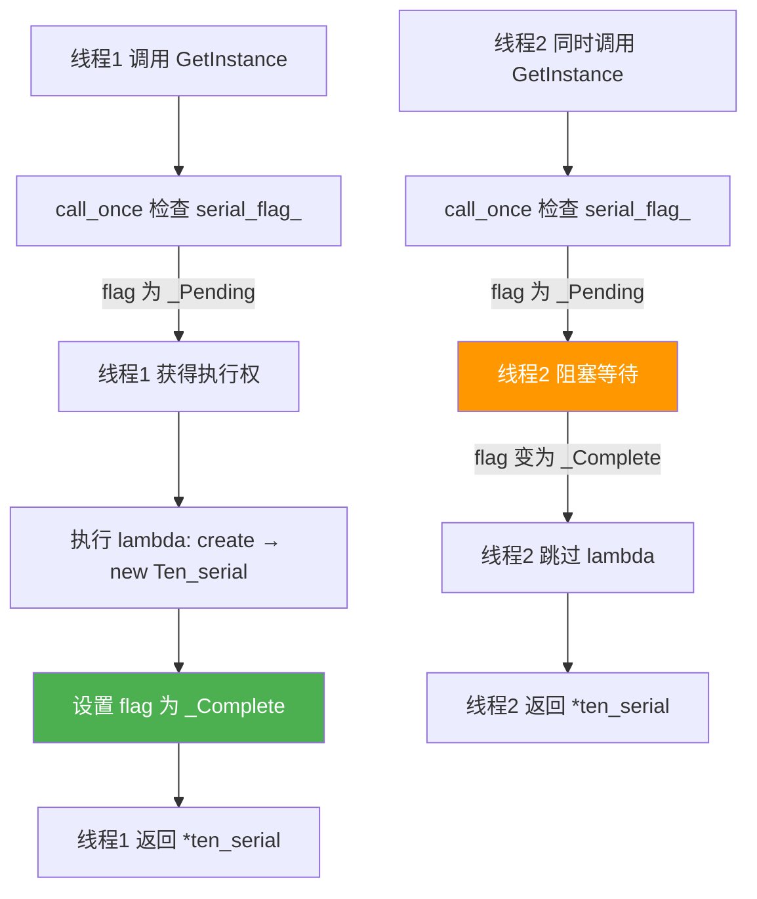

# `std::call_once` 与 `std::once_flag` — 原理及其在单例中的应用

> 本文以 `Ten_serial` 单例类中的实际用法为例，深入剖析 `std::call_once` / `std::once_flag` 的机制、底层实现、与其它单例方案的对比。

---

## 目录

1. [项目中的实际用法](#1-项目中的实际用法)
2. [`std::once_flag` 是什么](#2-stdonce_flag-是什么)
3. [`std::call_once` 的行为契约](#3-stdcall_once-的行为契约)
4. [底层实现原理](#4-底层实现原理)
5. [为什么这里用 `call_once` 而不是其他方式？](#5-为什么这里用-call_once-而不是其他方式)
6. [`call_once` vs 其他单例方案对比](#6-call_once-vs-其他单例方案对比)
7. [注意事项与陷阱](#7-注意事项与陷阱)
8. [调试与观测](#8-调试与观测)

---

## 1. 项目中的实际用法

### 1.1 声明（`serial.h`）

```cpp
// serial.h — 在类 private 区声明
static std::once_flag serial_flag_;
```

### 1.2 定义（`serial.cpp`）

```cpp
// serial.cpp — 在命名空间作用域定义（分配存储）
std::once_flag Ten_serial::serial_flag_;
```

### 1.3 使用（`serial.cpp` — `GetInstance` 中）

```cpp
Ten_serial& Ten_serial::GetInstance(const std::string& port, const size_t& serial_baud)
{
    static std::unique_ptr<Ten_serial> ten_serial = nullptr;
    std::call_once(serial_flag_, [port, serial_baud]() 
    {
        ten_serial = create(port, serial_baud);
        std::cout << "init_serial" << std::endl;
    });
    return *ten_serial;
}
```

**执行流程：**



---

## 2. `std::once_flag` 是什么

### 2.1 定义

```cpp
// <mutex> 头文件中
struct once_flag {
    constexpr once_flag() noexcept;           // 默认构造函数
    once_flag(const once_flag&) = delete;     // 不可拷贝
    once_flag& operator=(const once_flag&) = delete;  // 不可赋值
};
```

### 2.2 本质

`once_flag` 是一个**仅可默认构造、不可拷贝/赋值**的**标记类型**。其内部通常包含一个 `std::atomic<int>` 状态变量（实现相关，但行为一致）：

| 状态 | 含义 |
|------|------|
| **`_Pending`** (0) | 尚未执行，可被某个线程抢到执行权 |
| **`_Executing`** (1) | 正在执行中，其他线程应等待 |
| **`_Complete`** (2) | 已执行完毕，后续 `call_once` 直接返回 |

### 2.3 在类中的声明方式

```cpp
// 方式 1：静态成员（项目中采用）
class Ten_serial {
    static std::once_flag serial_flag_;  // 所有实例共享一个 flag
};

// 方式 2：函数内静态局部变量（也常见）
void foo() {
    static std::once_flag flag;          // 只在此函数内可见
    std::call_once(flag, []{ /* ... */ });
}
```

> 项目中用**静态成员**是因为 `GetInstance` 是静态函数，且单例的初始化逻辑属于类级别而非实例级别。

---

## 3. `std::call_once` 的行为契约

### 3.1 函数签名

```cpp
template<class Callable, class... Args>
void call_once(std::once_flag& flag, Callable&& f, Args&&... args);
```

### 3.2 核心保证

| 保证 | 说明 |
|------|------|
| **一次性** | 关联的 `Callable` 在 `flag` 生命周期内**恰好执行一次**（或视为一次） |
| **线程安全** | 多线程并发调用 `call_once(flag, ...)`，只有**一个**线程真正执行 `f` |
| **阻塞等待** | 其他线程在 `f` 执行完毕前**阻塞**，不会返回 |
| **异常回滚** | 如果 `f` 抛出异常，`flag` 回到 `_Pending` 状态，**下次调用会重试** |
| **happens-before** | `f` 的完成**同步于**所有等待线程的返回 |

### 3.3 异常回滚机制（关键！）

这是 `call_once` 区别于简单 `pthread_once` 的重要特性：

```cpp
std::once_flag flag;

// 第1次调用 —— 抛异常
try {
    std::call_once(flag, []{
        throw std::runtime_error("init failed");
    });
} catch (...) {
    // flag 回到 _Pending 状态
}

// 第2次调用 —— 会重新执行 lambda！
std::call_once(flag, []{
    std::cout << "这次成功" << std::endl;  // ✅ 会打印
});
```

**在项目中的意义：**
构造函数内 `serial_.open()` 可能抛异常，但 `call_once` 不会因此"永久中毒"——下次调用 `GetInstance` 时**会重试初始化**。不过实际项目中构造函数内还有一层 `while` 循环兜底，所以 `call_once` 的异常回滚更像是最后一道防线。

---

## 4. 底层实现原理

### 4.1 直观概念

`call_once` 底层 ≈ **一个原子状态变量 + 一个 mutex + 一个 condition_variable**：

```
flag (atomic<int>)
  ├─ 0 = _Pending  : 尚未执行
  ├─ 1 = _Executing: 有线程正在执行
  └─ 2 = _Complete : 已执行完
```

### 4.2 简化伪代码（基于 GCC libstdc++ 实现）

```cpp
// libstdc++ 实际实现简化版
template<typename Callable, typename... Args>
void call_once(once_flag& flag, Callable&& f, Args&&... args) {
    // 1. 快速路径：如果已经完成，直接返回
    if (flag._M_once() == _Once_complete) {
        return;
    }

    // 2. 尝试 CAS 将 _Pending → _Executing
    int expected = _Once_pending;
    if (flag._M_once().compare_exchange_strong(expected, _Once_executing,
                                                std::memory_order_acq_rel)) {
        // ── 我是"幸运线程" ──
        try {
            // 3. 执行函数
            std::invoke(std::forward<Callable>(f), std::forward<Args>(args)...);
            // 4. 执行成功 → 标记完成
            flag._M_once().store(_Once_complete, std::memory_order_release);
            // 5. 唤醒所有等待线程
            // ... (内部 mutex + condvar) ...
        } catch (...) {
            // 6. 异常 → 回滚到 _Pending
            flag._M_once().store(_Once_pending, std::memory_order_release);
            // 7. 唤醒所有等待线程（让它们竞争重试）
            // ...
            throw;  // 重新抛出异常
        }
    } else {
        // ── 我是"等待线程" ──
        // 自旋或阻塞直到 flag 变为 _Complete
        // 如果最终看到的是 _Pending（之前的执行线程抛异常了）
        // 则重新尝试 CAS 竞争执行权
    }
}
```

### 4.3 关键实现细节（libstdc++）

```
                  ┌─────────────────────────────────┐
                  │        once_flag                 │
                  │  ┌───────────────────────────┐   │
                  │  │  _M_once() (atomic<int>)   │   │
                  │  │  0 = _Pending              │   │
                  │  │  1 = _Executing            │   │
                  │  │  2 = _Complete             │   │
                  │  └───────────────────────────┘   │
                  │  ┌───────────────────────────┐   │
                  │  │  _M_mutex (mutex)          │   │
                  │  │  _M_cond (condition_variable)│  │
                  │  └───────────────────────────┘   │
                  └─────────────────────────────────┘
```

| 组件 | 作用 |
|------|------|
| `atomic<int>` | 无锁检查状态，快速路径只需一次 `load` |
| `mutex` | 保护等待队列，保证唤醒不丢失 |
| `condition_variable` | 实现等待线程的挂起和唤醒 |

### 4.4 内存序分析

```
第一个线程 (执行者):
  store(_Complete, release)  ──┐
                               │  synchronizes-with
第二个线程 (等待者):            │
  load(_Complete, acquire)  ───┘
```

- **release**: 执行线程在 `store` 之前的所有写入（如 `ten_serial` 的赋值）对等待线程**可见**
- **acquire**: 等待线程 `load` 之后能看到执行线程的所有副作用

---

## 5. 为什么这里用 `call_once` 而不是其他方式？

### 5.1 历史版本对比（项目中的注释）

```cpp
// 方式 0（被注释掉的旧方案）—— 非线程安全
static Ten_serial* ten_serial = nullptr;
// 多个线程同时调用时，可能创建多个对象！

// 方式 1（被注释掉的中间方案）—— 但 make_unique 无法访问私有构造函数
static std::unique_ptr<Ten_serial> ten_serial = nullptr;
ten_serial = std::make_unique<Ten_serial>(port, serial_baud);  // ❌ 编译错误

// 方式 2（最终方案）—— ✅ 正确
static std::unique_ptr<Ten_serial> ten_serial = nullptr;
std::call_once(serial_flag_, [port, serial_baud]() 
{
    ten_serial = create(port, serial_baud);  // create 是静态成员可访问私有构造函数
});
```

### 5.2 为什么不用 `std::make_unique`？

```cpp
// 这行代码在 GetInstance 中被注释掉了：
ten_serial = std::make_unique<Ten_serial>(port, serial_baud);
```

**原因：** `std::make_unique` 调用的是**公有构造函数**，而 `Ten_serial` 的构造函数是 `private` 的。`create` 是类的静态成员函数，可以绕过这个限制。

### 5.3 为什么不用 Meyers Singleton（函数内 static 变量）？

```cpp
// Meyers Singleton 方案（C++11 起线程安全）
Ten_serial& Ten_serial::GetInstance() {
    static Ten_serial instance;  // C++11 保证：首次调用时线程安全初始化
    return instance;
}
```

**项目为什么不采用？** 可能的原因：

| 原因 | 说明 |
|------|------|
| **构造函数参数** | Meyers Singleton 无法传参（或需要额外封装），而项目需要动态传 `port` 和 `baud` |
| **`unique_ptr` 延迟初始化** | 项目中用 `std::unique_ptr` + `create()` 处理私有构造函数 + 动态参数，更灵活 |
| **异常恢复** | Meyers Singleton 初始化失败后无法重试（`static` 变量只初始化一次） |
| **显式控制** | `call_once` + `unique_ptr` 让初始化时机和控制流更透明 |

---

## 6. `call_once` vs 其他单例方案对比

| 特性 | `call_once` + `unique_ptr` ✅ | Meyer's Singleton | `pthread_once` | Double-Checked Locking |
|------|:---:|:---:|:---:|:---:|
| C++ 标准 | C++11 | C++11 | POSIX (非标准) | 无标准 |
| 线程安全 | ✅ 原生 | ✅ 原生 | ✅ | ⚠️ 需谨慎 |
| 传参支持 | ✅ 灵活 | ❌ 硬编码 | ✅ | ✅ |
| 异常回滚 | ✅ **自动重置 flag** | ❌ 失败即永久 | ❌ 失败即永久 | ❌ 需手动处理 |
| 延迟初始化 | ✅ | ✅ | ✅ | ✅ |
| 代码可读性 | 中等 | **极高** | 低 | 低 |
| 控制反转 | ✅ 可控制何时初始化 | ❌ 首次调用即 init | ✅ | ✅ |
| 适用场景 | **参数化单例**、可能失败需重试 | 无参单例、不会失败 | 纯 C 项目 | 遗留代码 |

### 项目选型总结

```
Meyers Singleton (最简单)    不适合 ← 需要传参 + 私有构造函数
       ↓
call_once + create() (最终方案) ← 最佳平衡点
       ↓
Double-Checked Locking (太复杂) ← 没必要
```

---

## 7. 注意事项与陷阱

### 7.1 `once_flag` 不可拷贝/赋值

```cpp
std::once_flag f1;
std::once_flag f2 = f1;  // ❌ 编译错误
f1 = f2;                  // ❌ 编译错误
```

### 7.2 同一个 `flag` 不要混用不同函数

```cpp
std::once_flag flag;

// ❌ 错误：同一个 flag 用于不同逻辑
std::call_once(flag, initA);    // 第1次执行 initA
std::call_once(flag, initB);    // 第2次什么也不做（flag 已是 Complete）
// initB 永远不会被执行！
```

### 7.3 `call_once` 内部抛异常会回滚

```cpp
// 这是特性，不是 bug！
// 但如果不想重试，需要自己包一层：
std::call_once(flag, []{
    try {
        risky_init();
    } catch (...) {
        // 记录日志，不让异常逃逸
        std::cerr << "init failed, will NOT retry" << std::endl;
    }
});
// 这样 flag 会标记为 Complete，后续不再执行
```

### 7.4 递归调用 `call_once` 会导致死锁

```cpp
std::once_flag flag;

void inner() {
    std::call_once(flag, []{ /* ... */ });  // ❌ 死锁！
}

void outer() {
    std::call_once(flag, inner);
}
```

### 7.5 静态成员的 `once_flag` 需要**在类外定义**

```cpp
// serial.h 中声明
class Ten_serial {
    static std::once_flag serial_flag_;  // 声明
};

// serial.cpp 中定义（必须！）
std::once_flag Ten_serial::serial_flag_;  // 定义：分配存储 + 零初始化
```

如果忘记定义，链接器会报 **undefined reference** 错误。

---

## 8. 调试与观测

### 8.1 如何验证 `call_once` 只执行一次？

```cpp
// 在 lambda 中加入计数
int init_count = 0;
std::call_once(serial_flag_, [&init_count, port, serial_baud]() 
{
    init_count++;
    ten_serial = create(port, serial_baud);
});
std::cout << "init_count = " << init_count << std::endl;  // 永远是 1
```

### 8.2 验证异常回滚

```cpp
// 人为让第一次初始化失败
// 注释掉构造函数中的 while 循环
// 看 GetInstance 是否会重试
```

### 8.3 多线程并发测试

```cpp
#include <thread>
#include <vector>

void test_concurrent_getinstance() {
    std::vector<std::thread> threads;
    for (int i = 0; i < 10; i++) {
        threads.emplace_back([]{
            auto& serial = Ten::Ten_serial::GetInstance();
            std::cout << "线程 " << std::this_thread::get_id() 
                      << " 得到 serial 地址: " << &serial << std::endl;
        });
    }
    for (auto& t : threads) t.join();
    // 所有线程输出的地址应该相同，且 "init_serial" 只打印一次
}
```

---

## 附录：项目中 `call_once` 的完整上下文

### `serial.h` — 声明

```cpp
class Ten_serial
{
    // ... 公有接口 ...

private:
    Ten_serial(const std::string& port, const size_t& serial_baud);
    
    static std::unique_ptr<Ten_serial> create(const std::string& port, 
                                               const size_t& serial_baud) {
        return std::unique_ptr<Ten_serial>(new Ten_serial(port, serial_baud));
    }

    // ... 其他私有成员 ...

    // 关键：once_flag 静态成员
    static std::once_flag serial_flag_;      // ← 声明（第124行）
};
```

### `serial.cpp` — 定义与使用

```cpp
namespace Ten
{
    // 定义：为 serial_flag_ 分配存储
    std::once_flag Ten_serial::serial_flag_;  // ← ODR 使用（第14行）

    // ... serial_send, serial_read 等实现 ...

    Ten_serial& Ten_serial::GetInstance(const std::string& port, 
                                         const size_t& serial_baud)
    {
        static std::unique_ptr<Ten_serial> ten_serial = nullptr;
        
        // 核心：call_once 保证 lambda 只执行一次
        std::call_once(serial_flag_, [port, serial_baud]() 
        {
            ten_serial = create(port, serial_baud);  // 调用私有工厂函数
            std::cout << "init_serial" << std::endl;
        });
        
        return *ten_serial;  // 返回解引用后的实例
    }
}
```

### 数据流图

```
serial_flag_ (静态存储区)
  │  初值: _Pending (0)
  │
  ├── 第1次 GetInstance ──► CAS(_Pending → _Executing)
  │       │
  │       ├── create(port, baud)
  │       │     └── new Ten_serial(port, baud)
  │       │           ├── serial_.setPort(...)
  │       │           ├── serial_.setBaudrate(...)
  │       │           ├── ...
  │       │           └── serial_.open()
  │       │
  │       ├── ten_serial = 上面创建的 unique_ptr
  │       ├── flag.store(_Complete, release)
  │       └── 唤醒等待线程
  │
  ├── 第2~N次 GetInstance ──► load(_Complete) → 直接返回
  │
  └── 异常路径 ──► flag.store(_Pending, release) → 下次重试
```
