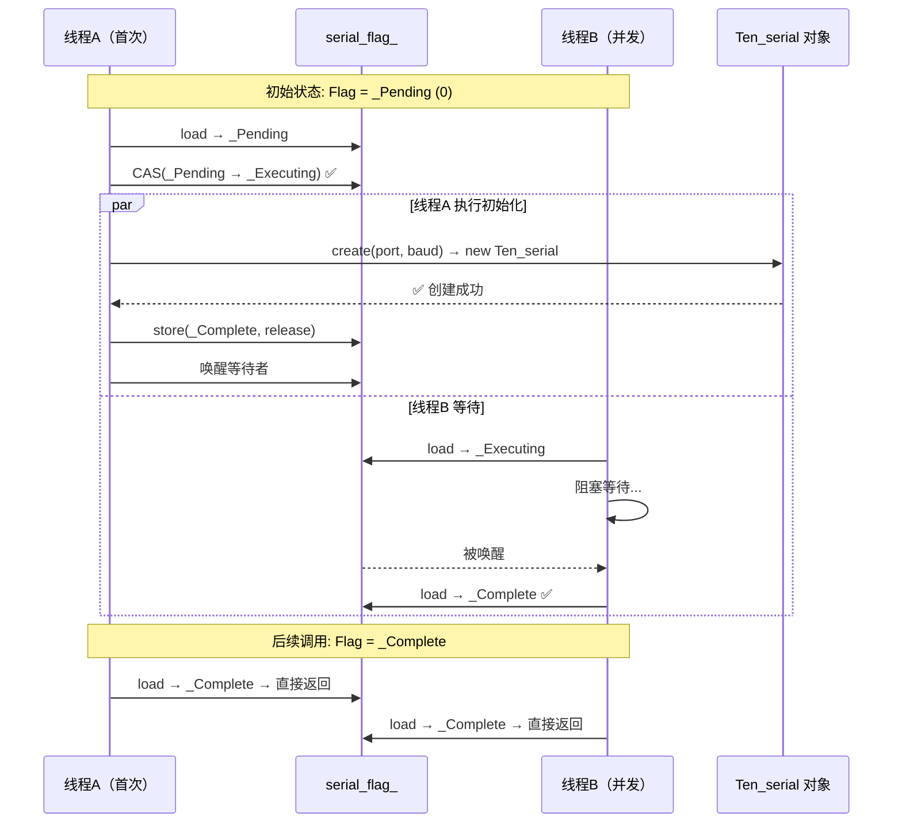

# `std::call_once` + `std::once_flag` 配合原理详解

> 以 `serial.cpp` 中 `GetInstance` 的实际代码为线索，彻底搞懂这两个东西是什么、怎么配合、底层怎么实现。

---

## 0. 目标代码

先定位我们要分析的这段代码（`serial.cpp` 第 249~257 行）：

```cpp
Ten_serial& Ten_serial::GetInstance(const std::string& port, const size_t& serial_baud)
{
    static std::unique_ptr<Ten_serial> ten_serial = nullptr;

    // ⭐ 就是这一句
    std::call_once(serial_flag_, [port, serial_baud]()
    {
        ten_serial = create(port, serial_baud);
        std::cout << "init_serial" << std::endl;
    });

    return *ten_serial;
}
```

而 `serial_flag_` 的声明在 `serial.h` 第 124 行：

```cpp
static std::once_flag serial_flag_;  // 类内声明（静态成员）
```

定义在 `serial.cpp` 第 14 行：

```cpp
std::once_flag Ten_serial::serial_flag_;  // 类外定义（分配存储）
```

---

## 1. 先理解 `std::once_flag` — 那个"旗子"

### 1.1 它是什么

`std::once_flag` 是一个非常简单的**标记类型**。可以把它想象成一个**只有 3 种状态的交通灯**：

```
状态 0: _Pending   （尚未执行，灯绿——可以通行）
状态 1: _Executing （正在执行，灯黄——有人正在过）
状态 2: _Complete  （已经执行完，灯红——禁止通行）
```

### 1.2 它内部长什么样（简化）

```cpp
// 标准库内部 ≈ 这样
struct once_flag {
    // 核心：一个原子整数，表示当前状态
    std::atomic<int> _M_once{0};
    // 0 = _Pending
    // 1 = _Executing
    // 2 = _Complete

    // 不可拷贝、不可赋值
    once_flag(const once_flag&) = delete;
    once_flag& operator=(const once_flag&) = delete;
};
```

**关键：** 它就是一个 `std::atomic<int>` 的封装，所有操作都是原子操作，不需要额外的锁就能安全地检查状态。

### 1.3 在项目中的角色

```cpp
// serial.h 中声明
static std::once_flag serial_flag_;
```

这个 `serial_flag_` 是 `Ten_serial` 类的**静态成员**——所有 `Ten_serial` "对象"（其实只有一个）共享同一个 flag。它存在的唯一目的就是**和 `call_once` 配对使用**，记录"初始化函数是否已经执行过"。

---

## 2. 再理解 `std::call_once` — 那个"执行者"

### 2.1 函数签名

```cpp
template<class Callable, class... Args>
void call_once(std::once_flag& flag, Callable&& f, Args&&... args);
```

| 参数 | 在本项目中的实际值 | 说明 |
|------|:---:|------|
| `flag` | `serial_flag_` | 关联的 once_flag，记录执行状态 |
| `f` | `[port, serial_baud]() { ... }` | 要执行的 lambda 函数 |
| `args` | （无） | 传给 f 的参数，这里是 lambda 捕获了 port 和 baud |

### 2.2 行为承诺（5 条黄金规则）

| # | 规则 | 说明 |
|:-:|------|------|
| 1 | **恰好执行一次** | 无论多少线程调用 `call_once(flag, ...)`，关联的 `f` 在整个程序生命周期中**只执行一次** |
| 2 | **只有一个线程执行** | 多线程并发时，只有一个"幸运线程"真正执行 `f`，其他线程**阻塞等待** |
| 3 | **异常回滚** | 如果 `f` 抛出异常，`flag` 回到 `_Pending` 状态，**下次调用会重试** |
| 4 | **同步保证** | `f` 中所有的写入操作，在 `call_once` 返回后，对所有调用线程**可见**（happens-before） |
| 5 | **不重复执行** | 一旦 `f` 成功返回，`flag` 标记为 `_Complete`，后续所有 `call_once` 调用**立即返回**，不再执行 |

---

## 3. 它们怎么配合？—— 逐行剖析

### 3.1 首次调用

假设程序启动后，线程 A 第一个调用了 `GetInstance`：

```
线程 A 进入 GetInstance
  │
  ├─ static unique_ptr<Ten_serial> ten_serial = nullptr;
  │   （静态局部变量初始化，只发生一次）
  │
  ├─ std::call_once(serial_flag_, lambda)
  │     │
  │     ├─ 读取 serial_flag_ 的状态：_Pending (0)
  │     ├─ CAS 尝试将 _Pending → _Executing：✅ 成功（只有 A 成功，其他线程会失败）
  │     │
  │     ├─ 执行 lambda：                          ← 真正的初始化在这里
  │     │     │
  │     │     ├─ ten_serial = create(port, baud)
  │     │     │     └─ new Ten_serial(port, baud)
  │     │     │           ├─ serial_.setPort(...)
  │     │     │           ├─ serial_.setBaudrate(...)
  │     │     │           ├─ serial_.open()
  │     │     │           └─ ✅ 串口打开成功
  │     │     │
  │     │     └─ std::cout << "init_serial"
  │     │
  │     ├─ 将 serial_flag_ 设为 _Complete (2)     ← 标记"已完成"
  │     ├─ 唤醒所有等待的线程
  │     └─ 返回
  │
  └─ return *ten_serial;   ← 返回已经创建好的串口对象
```

### 3.2 并发调用

假设在线程 A 执行 lambda 的过程中，线程 B 也调用了 `GetInstance`：

```
线程 B 进入 GetInstance
  │
  ├─ std::call_once(serial_flag_, lambda)
  │     │
  │     ├─ 读取 serial_flag_ 的状态：_Executing (1)
  │     ├─ CAS 尝试将 _Pending → _Executing：❌ 失败（被 A 抢先了）
  │     │
  │     └─ 进入等待：
  │           ├─ 自旋一小会儿（spin）
  │           ├─ 如果 A 还没完，挂起等待（condition_variable）
  │           └─ A 执行完 → 被唤醒 → 看到 _Complete → 直接返回
  │
  └─ return *ten_serial;   ← 和 A 拿到同一个对象
```

### 3.3 后续调用

线程 A 和 B 都返回后，线程 C、D、E... 再调用 `GetInstance`：

```
线程 C 进入 GetInstance
  │
  ├─ std::call_once(serial_flag_, lambda)
  │     │
  │     ├─ 读取 serial_flag_ 的状态：_Complete (2)
  │     └─ 快速路径直接返回，lambda 不执行
  │
  └─ return *ten_serial;   ← 直接返回已有对象
```

### 3.4 异常情况

假如第一次初始化时 `new Ten_serial(port, baud)` 抛异常了：

```
线程 A 执行 lambda
  │
  ├─ ten_serial = create(port, baud)
  │     └─ new Ten_serial(port, baud)
  │           └─ 抛异常 ❌（比如串口打不开）
  │
  ├─ catch 捕获异常
  ├─ 将 serial_flag_ 设回 _Pending (0)   ← 异常回滚！flag 复位
  ├─ 唤醒所有等待的线程
  └─ 重新抛出异常，向上传播
  
线程 B 之前被阻塞，现在被唤醒
  │
  ├─ 读取 serial_flag_：_Pending (0)     ← 注意！回到了 0
  ├─ CAS 尝试 _Pending → _Executing：✅ 成功
  ├─ 重新执行 lambda                      ← 重试初始化
  │     └─ new Ten_serial(port, baud)    ← 第二次尝试
  ...
```

**这就是 `call_once` 相比 `pthread_once` 的核心里程碑优势——异常安全，失败可重试。**

---

## 4. 底层实现原理

### 4.1 libstdc++ 实现简化版

```cpp
// GCC libstdc++ <mutex> 中的实际实现（高度简化）
template<typename Callable, typename... Args>
void call_once(once_flag& flag, Callable&& f, Args&&... args)
{
    // ① 快速路径：如果已经是 _Complete，直接返回
    if (flag._M_once.load(memory_order_acquire) == _Once_complete)
        return;

    // ② 尝试 CAS：_Pending → _Executing
    int expected = _Once_pending;
    if (flag._M_once.compare_exchange_strong(expected, _Once_executing,
                                              memory_order_acq_rel))
    {
        // ── 我是"执行线程" ──
        try {
            // 执行函数
            invoke(forward<Callable>(f), forward<Args>(args)...);
            // 成功 → 标记 _Complete
            flag._M_once.store(_Once_complete, memory_order_release);
            // 唤醒等待者
            // ... (内部 mutex + condvar) ...
        } catch (...) {
            // 失败 → 回滚到 _Pending
            flag._M_once.store(_Once_pending, memory_order_release);
            // 唤醒等待者，让它们竞争重试
            // ...
            throw;  // 异常继续传播
        }
    }
    else
    {
        // ── 我是"等待线程" ──
        // 自旋等待或阻塞等待直到状态变为 _Complete
        while (flag._M_once.load(memory_order_acquire) != _Once_complete) {
            if (flag._M_once.load(memory_order_acquire) == _Once_pending) {
                // 执行线程抛异常了，重新竞争
                // 回到开头重试 CAS
            }
            // 否则挂起等待
        }
    }
}
```

### 4.2 内存序分析

```cpp
// 执行线程
flag.store(_Complete, memory_order_release);
//                        ↑ release：此前的所有写入（创建 Ten_serial 等）
//                                  对其他线程可见

// 等待线程
flag.load(memory_order_acquire);
//               ↑ acquire：能看到执行线程 release 之前的所有写入
```

```
执行线程                         等待线程
  │                                │
  ├─ new Ten_serial(...)           │
  ├─ ten_serial = ...              │
  ├─ cout << "init_serial"         │
  ├─ store(2, release) ──sync──→  load(2, acquire)
  │                                ├─ *ten_serial 可见 ✅
  │                                ├─ serial_.isOpen() == true ✅
```

---

## 5. 完整的时序图



---

## 6. 为什么这个配合如此重要？—— 代码走读

从这个角度看 `GetInstance` 的全部保护措施：

```cpp
Ten_serial& Ten_serial::GetInstance(...)
{
    // ① 智能指针：保证程序结束时自动 delete → 自动 close()
    static std::unique_ptr<Ten_serial> ten_serial = nullptr;

    // ② call_once + once_flag：保证只初始化一次
    //    多线程安全 + 异常回滚 + happens-before
    std::call_once(serial_flag_, [port, serial_baud]()
    {
        ten_serial = create(port, serial_baud);
        std::cout << "init_serial" << std::endl;
    });

    // ③ 返回引用：保证所有人都操作同一个对象
    return *ten_serial;
}
```

这三行代码各司其职：

| 代码 | 解决的问题 | 如果没有会怎样 |
|------|-----------|---------------|
| `static unique_ptr` | 生命周期管理 + 自动析构 | 内存泄漏 / 忘记关闭串口 |
| `call_once + once_flag` | **多线程安全的一次性初始化** | 两个线程同时进入，创建两个串口对象 |
| `&` 返回引用 | 返回同一个对象，不拷贝 | 每个调用方拿到副本，单例失效 |

---

## 7. 调试验证

### 验证 "只执行一次"

```cpp
// 在 lambda 中加入打印
static int count = 0;
std::call_once(serial_flag_, [port, serial_baud, &count]()
{
    count++;
    ten_serial = create(port, serial_baud);
    std::cout << "lambda 执行次数: " << count << std::endl;  // 永远输出 1
});
```

### 验证 "多线程安全"

```cpp
#include <thread>
#include <vector>

void test_mt() {
    std::vector<std::thread> threads;
    for (int i = 0; i < 100; i++) {
        threads.emplace_back([]{
            auto& serial = Ten::Ten_serial::GetInstance();
            std::cout << &serial << std::endl;  // 所有线程输出相同地址
        });
    }
    for (auto& t : threads) t.join();
    // 控制台只打印一次 "init_serial"
}
```

### 验证 "异常回滚"

```cpp
// 人为让第一次失败（比如传一个不存在的串口路径）
try {
    auto& s = Ten::Ten_serial::GetInstance("/dev/null/nonexist", 115200);
    // 构造函数会抛异常 → call_once 回滚 flag
} catch (...) {
    std::cout << "第一次失败" << std::endl;
}

// 第二次调用，flag 已回滚到 _Pending，会重试
try {
    auto& s = Ten::Ten_serial::GetInstance("/dev/ttyACM0", 115200);
    // ✅ 这次会重新执行 lambda
} catch (...) {
    // ...
}
```

---

## 8. 类比：生活中的例子

> **`once_flag` 是一张"已打卡"记录卡，`call_once` 是打卡机。**

```
场景：公司门口只有一个打卡机，规定每人只能打卡一次

  once_flag = 打卡记录表（初始为"未打卡"）
  call_once = 打卡机的工作流程

  第一个人（线程A）来到：
    1. 看记录表 → "未打卡"
    2. 把记录表改为"打卡中"（防止别人同时打）
    3. 打卡（执行 lambda）
    4. 把记录表改为"已打卡"
    5. 开门让后面的人进来

  第二个人（线程B）同时来到：
    1. 看记录表 → "打卡中"
    2. 在旁边排队等（阻塞等待）
    3. 看到"已打卡" → 直接进去（不打卡了）

  第三个人（线程C）下午才来：
    1. 看记录表 → "已打卡"
    2. 直接进去（快速路径）

  如果第一个人打卡时机器坏了（抛异常）：
    1. 把记录表改回"未打卡"
    2. 叫下一个人来试试（重试）
```

---

## 一句话总结

> **`once_flag` 是状态存储器，`call_once` 是状态机的执行引擎。**
>
> `call_once` 通过原子 CAS 操作检查/修改 `once_flag` 的状态，确保只有一个线程能执行初始化 lambda，其他线程要么等待要么直接跳过。异常时 flag 自动回滚，保证下次还能重试——这就是 `GetInstance` 线程安全和异常安全的底层保障。
