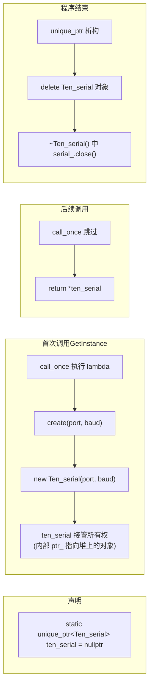

# 理解 `static std::unique_ptr<Ten_serial>`

> 分析这行代码：
> ```cpp
> static std::unique_ptr<Ten_serial> ten_serial = nullptr;
> ```

三个概念层层嵌套，逐一拆解。

---

## 1. `<Ten_serial>` — 模板参数（Template Argument）

### 1.1 `<>` 是什么

`<>` 是 C++ **模板（template）** 的语法。`std::unique_ptr` 不是一个具体的类，而是一个**类模板**——类似于"类工厂"：

```cpp
// unique_ptr 的定义 ≈ 这样
template<typename T>
class unique_ptr {
    T* ptr_;           // T 是什么类型，ptr_ 就是什么类型的指针
public:
    explicit unique_ptr(T* p) : ptr_(p) {}
    ~unique_ptr() { delete ptr_; }
    T& operator*() { return *ptr_; }
    T* operator->() { return ptr_; }
    // ...
};
```

`T` 是一个**类型参数**——使用的时候"填进去"：

```cpp
std::unique_ptr<int>          p1(new int);           // T = int
std::unique_ptr<Ten_serial>   p2(new Ten_serial(...)); // T = Ten_serial
std::unique_ptr<std::string>  p3(new std::string);     // T = std::string
```

编译器看到每个不同的 `T`，会生成一份对应的代码：

```
std::unique_ptr<int>          → 生成 class unique_ptr<int>
std::unique_ptr<Ten_serial>   → 生成 class unique_ptr<Ten_serial>
std::unique_ptr<std::string>  → 生成 class unique_ptr<std::string>
```

### 1.2 可以理解为"填空题"

```
std::unique_ptr<______>
                ⬆ 填什么类型，就管理什么类型的指针
```

| 写法 | 内部 ptr_ 类型 | 析构时 delete |
|------|:---:|:---:|
| `unique_ptr<int>` | `int*` | `delete int` |
| `unique_ptr<Ten_serial>` | `Ten_serial*` | `delete Ten_serial` |
| `unique_ptr<FILE>` | `FILE*` | `delete FILE`（或自定义删除器） |

---

## 2. `std::unique_ptr` — 独占所有权智能指针

### 2.1 核心思想：RAII

> **Resource Acquisition Is Initialization（资源获取即初始化）**
>
> 资源在构造函数中获取，在析构函数中释放。

```cpp
// 原始指针——手动管理，容易忘
Ten_serial* raw = new Ten_serial(port, baud);
// ... 使用 ...
delete raw;  // 万一忘了写 → 内存泄漏

// unique_ptr——自动管理
std::unique_ptr<Ten_serial> ptr(new Ten_serial(port, baud));
// ... 使用 ...
// ptr 走出作用域时，析构函数自动 delete
```

### 2.2 "unique"的含义

**独占所有权**——同一时刻只有一个 `unique_ptr` 指向某个对象：

```cpp
std::unique_ptr<Ten_serial> a = create(port, baud);
std::unique_ptr<Ten_serial> b = a;  // ❌ 编译错误！不允许拷贝

std::unique_ptr<Ten_serial> c = std::move(a);  // ✅ 允许移动
// 移动后 a = nullptr，c 接管所有权
```

适合单例：**唯一的管理者，管理唯一的对象。**

### 2.3 内部结构（零额外开销）

```cpp
// 简化版 unique_ptr 内部
template<typename T>
class unique_ptr {
    T* ptr_;  // ← 唯一成员：一个裸指针
    // sizeof(unique_ptr) == sizeof(T*)  — 零额外开销
public:
    explicit unique_ptr(T* p = nullptr) : ptr_(p) {}
    ~unique_ptr() { delete ptr_; }
    // ...
};
```

`unique_ptr` 的大小和一个裸指针完全相同（通常 8 字节），没有性能损失。

---

## 3. `static` — 静态存储期

这里有两个 `static`：

### 3.1 函数内的 `static` 局部变量

```cpp
void some_function() {
    int normal_var = 0;          // 每次进入函数创建，退出销毁
    static int static_var = 0;   // 程序启动时创建，程序结束时才销毁
}
```

| 特性 | 普通局部变量 | `static` 局部变量 |
|:----:|:----------:|:----------------:|
| 初始化时机 | 每次进入函数 | 程序启动时（第一次经过声明时） |
| 销毁时机 | 函数返回时 | 程序结束时 |
| 值保持 | 不保持 | **保持**（下次调用还在） |

### 3.2 为什么单例需要 `static`

```cpp
Ten_serial& Ten_serial::GetInstance(...)
{
    // 没有 static：每次调用都创建新的 unique_ptr（初值 nullptr）
    //            函数返回后销毁，啥都没留住
    // 有 static：只初始化一次，函数返回后依然存在
    static std::unique_ptr<Ten_serial> ten_serial = nullptr;
    //    ^^^^^^
    
    std::call_once(serial_flag_, [port, serial_baud]() {
        ten_serial = create(port, serial_baud);
    });
    
    return *ten_serial;
}
```

---

## 4. 合在一起逐层理解

### 4.1 从外到内拆解

```cpp
static   std::unique_ptr<Ten_serial>   ten_serial   = nullptr;
// ①       ②                             ③           ④
```

| 编号 | 成分 | 含义 |
|:---:|------|------|
| ① | `static` | 这个变量存储在**静态存储区**，函数返回后不销毁 |
| ② | `std::unique_ptr<Ten_serial>` | 一个智能指针类型，专门管理 `Ten_serial*` |
| ③ | `ten_serial` | 变量名 |
| ④ | `= nullptr` | 初始化为空，还没有管理任何对象 |

### 4.2 完整生命周期



### 4.3 为什么不用裸指针？

```cpp
// 旧方案（被注释掉）—— 裸指针
static Ten_serial* ten_serial = nullptr;
ten_serial = new Ten_serial(port, baud);  // 谁来 delete？

// 新方案 —— unique_ptr
static std::unique_ptr<Ten_serial> ten_serial = nullptr;
ten_serial = create(port, baud);  // 自动 delete
```

| 方案 | 析构 | 风险 |
|:----:|:----:|:----:|
| 裸指针 | 没人 delete | **内存泄漏** |
| `unique_ptr` | 程序结束时自动 delete | 无泄漏 |

### 4.4 内存布局图

```
静态存储区（程序启动到结束）
┌──────────────────────────────────────────┐
│  ten_serial (unique_ptr<Ten_serial>)      │
│  ┌──────────────────┐                    │
│  │ ptr_ (8 bytes)   │────→ 堆内存         │
│  └──────────────────┘       │            │
└──────────────────────────────┼────────────┘
                               │
堆内存（new 出来的对象）        │
┌──────────────────────────────┼──────────┐
│  Ten_serial 对象              │          │
│  ┌─────────────────────────┐ │          │
│  │ serial_ (serial::Serial)│ │          │
│  │ send_mtx_ (mutex)       │ │          │
│  │ read_mtx_ (mutex)       │ │          │
│  │ port_ (string)          │ │          │
│  │ ...                     │ │          │
│  └─────────────────────────┘ │          │
└──────────────────────────────┼──────────┘
                               ptr_ 指向这里
```

---

## 5. 对比：`create()` 工厂函数

```cpp
static std::unique_ptr<Ten_serial> create(const std::string& port,
                                           const size_t& serial_baud) {
    return std::unique_ptr<Ten_serial>(new Ten_serial(port, serial_baud));
}
```

**为什么不用 `std::make_unique`？**

```cpp
// 这行被注释掉了
ten_serial = std::make_unique<Ten_serial>(port, serial_baud);  // ❌ 编译错误
```

原因：`std::make_unique` 在内部调用构造函数，但它不是 `Ten_serial` 的成员，**无法访问 private 构造函数**。

```cpp
// make_unique 内部 ≈ 这样
template<typename T, typename... Args>
unique_ptr<T> make_unique(Args&&... args) {
    return unique_ptr<T>(new T(args...));  // 需要 T 构造函数是 public
}
```

而 `create()` 是 `Ten_serial` 的**静态成员**，可以访问 private 构造函数：

```cpp
// create 可以这样写
return std::unique_ptr<Ten_serial>(new Ten_serial(port, serial_baud));
//                                      ↑ create 是类成员，可以访问私有构造函数
```

---

## 6. 一句话总结

> **`static std::unique_ptr<Ten_serial> ten_serial = nullptr;`**
>
> - `<>` 把模板参数填为 `Ten_serial`，让 `unique_ptr` 知道管理什么类型
> - `unique_ptr` 用 RAII 保证自动 `delete`，杜绝内存泄漏
> - `static` 让这个智能指针在函数返回后继续存活，保持单例
> - 三者合在一起 = **一个贯穿程序生命周期的、自动管理内存的、唯一的串口对象持有者**
