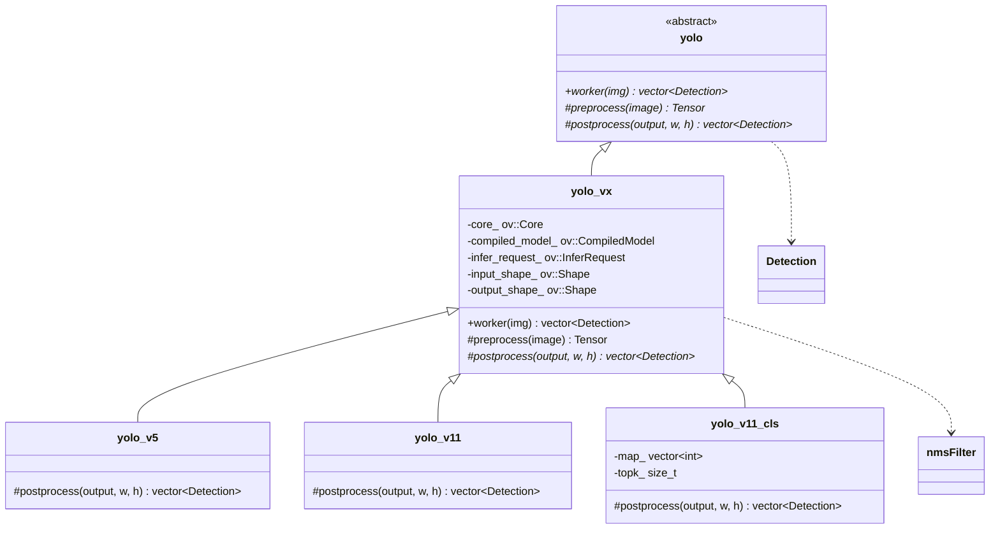

# C++ YOLO + OpenVINO 推理实战指南

> 基于 `yolo_base` / `yolo_vx` / `yolo_v5` / `yolo_v11` / `yolo_v11_cls` / `yolo_han2` 的工程级推理方案详解

---

## 目录

- [1. 概述：这一套代码解决了什么问题](#1-概述这一套代码解决了什么问题)
- [2. 核心概念 — 本质与机制](#2-核心概念--本质与机制)
  - [2.1 OpenVINO 推理流水线](#21-openvino-推理流水线)
  - [2.2 YOLO 输出的本质](#22-yolo-输出的本质)
  - [2.3 NMS 非极大值抑制](#23-nms-非极大值抑制)
  - [2.4 ROI 空位检测的特殊性](#24-roi-空位检测的特殊性)
- [3. 面向对象架构分析](#3-面向对象架构分析)
  - [3.1 继承体系全景](#31-继承体系全景)
  - [3.2 模板方法模式：固定流程，可变步骤](#32-模板方法模式固定流程可变步骤)
  - [3.3 策略模式：同一接口，不同算法](#33-策略模式同一接口不同算法)
  - [3.4 为什么不用泛型/函数指针](#34-为什么不用泛型函数指针)
- [4. 源码逐层解析](#4-源码逐层解析)
  - [4.1 公共基底 `yolo_base` — 数据结构和工具函数](#41-公共基底-yolo_base--数据结构和工具函数)
  - [4.2 引擎层 `yolo_vx` — 模板方法骨架](#42-引擎层-yolo_vx--模板方法骨架)
  - [4.3 检测子类 `yolo_v5` / `yolo_v11`](#43-检测子类-yolo_v5--yolo_v11)
  - [4.4 分类子类 `yolo_v11_cls`](#44-分类子类-yolo_v11_cls)
  - [4.5 独立处理器 `yolo_han2` — 批量 ROI 空位检测](#45-独立处理器-yolo_han2--批量-roi-空位检测)
- [5. 实际工程使用指南](#5-实际工程使用指南)
- [6. 常见陷阱与最佳实践](#6-常见陷阱与最佳实践)
- [7. 工程经验总结](#7-工程经验总结)

---

## 1. 概述：这一套代码解决了什么问题

机器人视觉系统中，需要在 12 个固定位置判断是否有方块（空位检测），并对存在的方块做分类（32 类）。这涉及：

- **两种模型**：ROI12 筛空模型（自定义输出格式） + YOLOv5/v11 检测/分类模型
- **一个引擎**：Intel OpenVINO（CPU/GPU 异构推理）
- **一个架构**：面向对象的多态继承体系，让上层业务代码对具体模型无感

```
┌──────────────────────────────────────────┐
│  super2.h（业务层）                       │
│  "我不管模型是 v5 还是 v11，调 worker 就行" │
└────────────┬─────────────────────────────┘
             │ 依赖抽象
┌────────────▼─────────────────────────────┐
│  yolo（抽象接口）                         │
│  virtual worker(img) → vector<Detection> │
└────────────┬─────────────────────────────┘
             │
     ┌───────┴───────┐
     │               │
┌────▼────┐   ┌──────▼──────┐
│ yolo_v5 │   │ yolo_v11    │  ← 只覆盖 postprocess
└────┬────┘   └──────┬──────┘
     │               │
┌────▼───────────────▼──────┐
│ yolo_vx（OpenVINO 引擎）    │
│ preprocess / worker        │
│ postprocess = 纯虚函数      │
└────────────────────────────┘
```

---

## 2. 核心概念 — 本质与机制

### 2.1 OpenVINO 推理流水线

OpenVINO 把模型推理拆成五个不可跳跃的阶段，每阶段对应一个对象：

```
读取模型          编译优化            创建推理请求        预处理输入          执行推理
ov::Core    →   ov::CompiledModel  →  ov::InferRequest →  ov::Tensor    →  infer()
.read_model()   .compile_model()     .create_infer_      .set_input_     .start_async()
.xml + .bin      ("CPU"/"GPU")       request()           tensor()        .wait()
```

**每个对象为什么是独立的？**

| 对象 | 创建频率 | 原因 |
|------|----------|------|
| `ov::Core` | 进程级单例 | 管理所有硬件插件和全局缓存，重复创建开销大 |
| `ov::CompiledModel` | 模型级单例 | 编译 = 图优化 + 算子融合 + 内存分配（几百ms），一次编译反复用 |
| `ov::InferRequest` | 推理级实例 | 持有单次推理的输入/输出 buffer，可复用但**不能多线程共用同一个** |
| `ov::Tensor` | 每次推理创建 | 实际数据载体，每次图片不同 |

**本质**：OpenVINO 的设计哲学是"重的操作做一次（编译），轻的操作重复做（推理）"。编译模型时做图优化（层融合、常量折叠、精度量化），推理时直接跑优化后的计算图——这就是 OpenVINO 比直接跑 PyTorch 快 3-5 倍的原因。

> **🔰 记住**：`Core` 和 `CompiledModel` 在构造函数中创建一次就够了，`InferRequest` 绑在实例上复用，`Tensor` 每次推理时临时创建。

---

### 2.2 YOLO 输出的本质

YOLO 不论版本，输出的原始数据都是**一个巨大的浮点数组**，只是排列方式不同：

**YOLOv5 格式** `[1, 25200, N]`：
```
output[i][0..3] = cx, cy, w, h   ← 归一化坐标（除以输入尺寸）
output[i][4]    = obj_conf       ← 物体置信度
output[i][5..N] = cls_0..cls_M   ← M 个类别的置信度
```

**YOLOv11 格式** `[1, N, 8400]`：
```
output[0][i] = cx_i               ← 通道 0 存所有框的 cx
output[1][i] = cy_i               ← 通道 1 存所有框的 cy
output[2][i] = w_i                ← ...
output[3][i] = h_i
output[4..N][i] = cls_conf_i      ← 通道索引即类别 ID
```

两种布局的读法完全不同——v5 按检测框遍历内存连续，v11 按通道遍历内存跳跃。后处理代码的差异全源于此。

> **🔰 记住**：YOLO 输出 = 坐标 + 置信度，后处理 = 解码坐标 → 过滤低分 → NMS 去重。不同版本唯一的区别是"坐标和置信度在数组里怎么排"。

---

### 2.3 NMS 非极大值抑制

NMS 解决的核心问题：**同一个物体被模型检测出多个重叠框，只保留最好的那个。**

```
算法四步（O(n²) 朴素实现）：

1. 按置信度降序排列所有框
2. 取最高分框 A 作为基准
3. 遍历剩余框 B：如果 B 和 A 同类别且 IOU > 阈值 → 丢弃 B
4. 对下一个未被丢弃的框重复 2-3
```

**IOU = 交集面积 / 并集面积**。两个框完全重叠时 IOU=1，完全不重叠时 IOU=0。

**本质**：NMS 是一个贪心算法——每次选当前最高分的框，然后"吃掉"所有和它重叠过度的同类别框。不是全局最优，但足够好。

> **🔰 记住**：NMS 只在**同类别**之间做。人和自行车即使完全重叠也不互相抑制。阈值通常设 0.5（检测）或 0（不过滤，交给后处理）。

> **⚡ 工程陷阱**：NMS 会**直接修改传入的 vector**（排序打乱顺序），所以调用方要自己先备份如果需要保留原始顺序。本项目用 `std::vector<Detection>& sorted_dets = detections` 直接操作引用，调用者如果想保留原始排序需要自己复制。

---

### 2.4 ROI 空位检测的特殊性

常规 YOLO 输出检测框的坐标，但 **ROI 空位检测**`yolo_han2` 完全不同：

- **输入**：不是一张大图，而是 12 张已裁剪好的 ROI 小图（64×64）
- **输出**：不是坐标+类别，而是每个 ROI 的两个值：`valid_empty_`（是空位的概率）、`valid_exist_`（有方块的概率）
- **批量推理**：12 张图拼成 batch，一次推理全部出结果

```
常规 YOLO:
  640×640 大图 → 推理 → N 个检测框 (cx, cy, w, h, cls, conf)

ROI 空位:
  12×64×64 小图 → 推理 → 12×2 个浮点数 (empty_prob, exist_prob)
```

**本质**：ROI 空位检测 = 把目标检测问题降维成二分类问题——每个位置独立判断"有"还是"没有"。减少了一个维度的复杂度（不需要回归坐标），所以可以用更轻量的模型。

---

## 3. 面向对象架构分析

### 3.1 继承体系全景



### 3.2 模板方法模式：固定流程，可变步骤

这是本项目最核心的设计模式。`yolo_vx::worker()` 定义了**不可变的推理流程骨架**：

```cpp
virtual std::vector<Detection> worker(cv::Mat& img) override {
    // 1. resize        ← 固定
    cv::resize(img, resized, cv::Size(input_shape_[3], input_shape_[2]));

    // 2. 预处理        ← 固定（BGR→RGB→归一化→CHW→Tensor）
    ov::Tensor input_tensor = preprocess(resized);

    // 3. 推理          ← 固定
    infer_request_.set_input_tensor(input_tensor);
    infer_request_.start_async();
    infer_request_.wait();

    // 4. 后处理        ← ⚡ 可变！由子类覆盖
    auto output = infer_request_.get_output_tensor();
    return postprocess(output, img.cols, img.rows);
}
```

子类只需要覆盖 `postprocess()`，其他四个步骤完全继承。这带来了两个工程级好处：

1. **Bug 隔离**：如果推理结果不对，bug 一定在子类的 `postprocess` 里，前四步是铁板一块不用排查
2. **新增模型 = 新增一个子类，只写 50 行后处理代码**，不用重复 OpenVINO 引擎的 100+ 行

### 3.3 策略模式：同一接口，不同算法

`yolo` 抽象基类只定义接口：

```cpp
virtual std::vector<Detection> worker(cv::Mat& img) = 0;  // 纯虚函数
```

上层代码（如 `super2.h`）只依赖 `yolo` 接口，不关心具体模型：

```cpp
// super_init 中
Ten::yolo::yolo_vx& yolo_detector_;   // 实际可以是 v5 / v11 / v11_cls，但都是 yolo_vx 子类

// 使用时
auto result = yolo_detector_.worker(img);  // 多态调用，运行时决定走哪个 postprocess
```

**本质**：开放-封闭原则——对扩展开放（加新模型只加子类），对修改封闭（不改动使用方代码）。

### 3.4 为什么不用泛型/函数指针

| 方案 | 问题 |
|------|------|
| 模板泛型 `yolo<PostProcessPolicy>` | 编译期绑定，不能在运行时切换模型。所有用到 `yolo` 的地方都要模板化，编译慢、错误信息长 |
| 函数指针 `void (*postprocess)(...)` | 无法携带状态。`yolo_v11_cls` 需要 `map_` 和 `topk_`，函数指针做不到 |
| 虚函数继承 ✅ | 运行时多态 + 每子类拥有独立状态 + 接口清晰。虚函数开销 ~5ns，在毫秒级推理中可忽略 |

**一句话**：需要运行时多态 + 有状态的，用虚函数继承。编译期确定且无状态的，用模板。

---

## 4. 源码逐层解析

### 4.1 公共基底 `yolo_base` — 数据结构和工具函数

```cpp
struct Detection {
    double cx_, cy_, w_, h_;  // 中心坐标 + 宽高（已反归一化到像素坐标）
    double conf_;             // 置信度
    int cls_id_;              // 类别 ID
};
```

> **⚡ 工程陷阱**：`Detection` 用 `double` 而不用 `float`。对 YOLO 推理来说 `float` 完全够用，`double` 在这里多消耗一倍内存且没有精度收益。这是从 PyTorch 代码直接翻译过来的痕迹，如果检测框数量超过 10 万会有明显内存差异。

**`calculateIOU`** — 标准 IOU 计算，有除零保护（`union_area < 1e-9` 返回 0）。

**`nmsFilter`** — 见上文 2.3 节分析。额外注意：**直接修改传入的引用参数**，调用方如需保留原始顺序必须自己复制。

---

### 4.2 引擎层 `yolo_vx` — 模板方法骨架

**构造函数做的事（按序）**：

```cpp
yolo_vx(const std::string model_path, const std::string xpu) {
    core_ = ov::Core();                                         // ① 初始化 OpenVINO 运行时
    model_ = core_.read_model(path + ".xml", path + ".bin");    // ② 读 IR 模型文件
    compiled_model_ = core_.compile_model(model_, xpu);         // ③ 编译优化
    input_shape_ = compiled_model_.input().get_shape();         // ④ 提取输入/输出维度
    output_shape_ = compiled_model_.output().get_shape();       //    供子类 postprocess 使用
    infer_request_ = compiled_model_.create_infer_request();    // ⑤ 创建推理请求
}
```

> **⚡ 工程陷阱**：如果 `.xml` 和 `.bin` 文件不存在或格式错误，`read_model` 抛异常，构造函数体不会执行完。调用方需要用 try-catch 包裹构造，否则程序直接崩。本项目没有这样做——依赖部署时确保模型文件存在。

**`preprocess` 做的事**：

```
BGR → RGB → float32/255.0 → 拆成三个单通道 → memcpy 进 CHW 格式的 ov::Tensor
```

> **🔰 记住**：为什么要 BGR→RGB？OpenCV 默认 BGR，PyTorch 训练时用 RGB。BGR 送进 RGB 训练的模型 = 等效于把红色和蓝色交换，检测结果会完全错误。

**`worker` 中的同步等待**：

```cpp
infer_request_.start_async();  // 提交异步推理
infer_request_.wait();         // 立即阻塞等待结果
```

这实际上是**伪异步调用**——调了异步接口但马上同步等待。真正的异步用法是：提交后去做其他事，需要结果时再 wait。但在这个项目里每个线程只做一件事（推理），异步没有收益。

> **⚡ 工程陷阱**：如果去掉 `wait()` 直接 `get_output_tensor()`，会读到未完成的推理结果（随机数据）。OpenVINO 不会报错，结果看起来正常但值不对——这是最隐蔽的 bug。

---

### 4.3 检测子类 `yolo_v5` / `yolo_v11`

两者唯一的区别是 `postprocess` 中的数据读取方式：

| | v5 `[1, 25200, N]` | v11 `[1, N, 8400]` |
|---|---|---|
| 读取 cx | `data[i*feat + 0]` | `data[0*8400 + i]` |
| 遍历方式 | 按检测框，内存连续 | 按通道跳跃，cache 不友好 |
| 类别数 | `features_per_box - 5` | `features_per_box - 4` |

v11 的布局对 CPU cache 不友好（每次读一个值跳 8400 个 float），但 v11 本身检测框更少，实际性能差异可忽略。

两者的 `postprocess` 都依赖父类 `yolo_vx` 的 `input_shape_` 做坐标反归一化。

> **⚡ 工程陷阱**：`yolo_v5` 中硬编码了 `output_shape_[1] != 25200` 的校验。如果换了不同输入尺寸的 v5 模型（比如 320×320 输出 6300 个框），构造函数直接设 `flag_=0` 导致所有 `worker` 返回空结果，无任何错误提示。校验逻辑应该更灵活或至少打印信息。

---

### 4.4 分类子类 `yolo_v11_cls`

与检测子类的关键区别：

```cpp
// 检测：输出坐标 + 类别
result.push_back({cx_, cy_, w_, h_, confidence, cls_id});

// 分类：不关心坐标，填 -1
detections.push_back({-1, -1, -1, -1, filter_[0].confidence_, map_[filter_[0].item_]});
```

**`map_` 映射表**的作用：模型输出的是 0~31 的索引，但业务含义不同（1=R1, 2~16=R2, 17~31=fake, 32=空），`map_` 做一次翻译。

```cpp
// super_init 中:
std::vector<int> mapping_ = {1, 10, 11, ..., 32, ...};
// yolo_v11_cls 得到模型输出 idx=0 → 映射为 mapping_[0]=1 (R1)
```

> **🔰 记住**：`map_` 是"索引 → 业务 ID"的翻译表。修改映射关系不需要重新训练模型，只改这个数组。

> **⚡ 工程陷阱**：构造函数中 `topk > output_shape_[1]` 校验不充分——如果 `topk=1` 但 `map_.size() != output_shape_[1]`，不会报错但 `map_[index]` 可能越界。越界读取是未定义行为，该位置产出的类别 ID 是随机值，且不会被后续代码检测到。

---

### 4.5 独立处理器 `yolo_han2` — 批量 ROI 空位检测

`yolo_han2` 没有继承 `yolo` / `yolo_vx`，因为它的接口完全不同：

| | yolo 体系 | yolo_han2 |
|---|---|---|
| 输入 | 单张 `cv::Mat` | 12 张 `vector<cv::Mat>` |
| 输出 | `vector<Detection>` | `vector<han2>`（每位置 empty/exist 概率） |
| 预处理 | BGR→RGB→/255→CHW | BGR→RGB→**标准化 (mean/std)** →CHW |

`han2` 结构：
```cpp
struct han2 {
    float valid_empty_;  // 该位置判断为"空"的概率
    float valid_exist_;  // 该位置判断为"有方块"的概率
};
```

**预处理差异**：`yolo_han2` 使用 ImageNet 标准化（mean=[0.485,0.456,0.406], std=[0.229,0.224,0.225]），而普通 yolo 只用 `/255.0`。这是训练框架决定的——ROI 模型基于 torchvision 预训练权重，必须匹配其预处理管线。标准化的本质是让输入分布对齐训练时的分布。

> **⚡ 工程陷阱**：两个体系共用一个 `yolo_base.h` 但是预处理逻辑完全不同。如果有人把 `yolo_han2` 的 `normalizeRGBImage` 用到普通 yolo 上（或反过来），推理结果会完全错误。两者应拆分到不同的 base，或至少在函数命名上体现差异。

---

## 5. 实际工程使用指南

### 5.1 模型部署流程图

```
训练（Python/PyTorch）
    ↓ torch.export / ONNX
模型文件 .pt
    ↓ ovc 工具
IR 文件 .xml + .bin      ← OpenVINO 的标准格式
    ↓ C++ read_model()
工程推理代码
```

### 5.2 与 super2.h 的集成

```cpp
// super_init 中声明模型成员
struct super_init {
    Ten::yolo::yolo_han2 yolo_han2_;           // ROI12 空位检测
    Ten::yolo::yolo_v11_cls yolo_detector_;    // 方块分类（32 类）

    super_init()
        : yolo_han2_(model_path, device)         // 构造时加载模型
        , yolo_detector_(cls_path, "cpu", mapping_)
    {}
};

// 使用时
// 1. 先筛空
det_1 = super_init_.yolo_han2_.worker(roi_images_);
// 2. 再分类
classifier_ = super_init_.yolo_detector_.worker(roi_images_[i]);
```

### 5.3 新增模型的步骤

假设要新增 YOLOv8 支持，只需要：

```cpp
// 1. 继承 yolo_vx，只写 postprocess
class yolo_v8 : public yolo_vx {
public:
    yolo_v8(const std::string& path, const std::string& xpu, float conf = 0.75, float iou = 0.0)
        : yolo_vx(path, xpu), conf_thres_(conf), iou_(iou) {
        // 添加 v8 特有的维度校验
        if (output_shape_[1] != 84) flag_ = 0;
    }

protected:
    std::vector<Detection> postprocess(ov::Tensor& output, int w, int h) override {
        // v8 的输出是 [1, 84, 8400]，其中前 4 通道是 bbox，后 80 通道是 COCO 类别
        const float* data = output.data<float>();
        std::vector<Detection> result;
        for (int i = 0; i < 8400; i++) {
            float cx = data[0 * 8400 + i];  // 通道 0
            float cy = data[1 * 8400 + i];  // 通道 1
            // ... 同 v11 的读取逻辑 ...
        }
        return nmsFilter(result, iou_);
    }

    float conf_thres_;
    float iou_;
};

// 2. 使用——和 v5/v11 完全一样的调用方式
yolo_v8 detector("/path/to/model", "CPU");
auto results = detector.worker(img);
```

**约 40 行代码，不需要接触 OpenVINO 引擎层**。这就是模板方法模式的价值。

### 5.4 GPU vs CPU 选择

```cpp
if (xpu == "gpu") {
    compiled_model_ = core_.compile_model(model_, "GPU");
} else {
    compiled_model_ = core_.compile_model(model_, "CPU");
}
```

| 场景 | 推荐 | 原因 |
|------|------|------|
| 小模型（<10M 参数） | CPU | GPU 调度开销 > 推理收益 |
| 大模型（>50M 参数） | GPU | 并行矩阵乘法优势明显 |
| 批量推理（batch>1） | GPU | GPU 的并行度随 batch 线性提升 |
| 实时单帧推理 | CPU | 避免 CPU→GPU 数据传输延迟（~1ms） |
| Intel 集显（iGPU） | 慎用 GPU | 共享内存带宽，可能不如多核 CPU |

本项目中 ROI 模型（轻量）和分类模型都跑 CPU，这是正确的选择。

---

## 6. 常见陷阱与最佳实践

### 6.1 ❌ 陷阱一：OpenCV BGR 喂进 RGB 模型

```cpp
// ❌ 直接送 cv::Mat 进模型（大部分模型训练时用 RGB）
auto tensor = preprocess(img);  // img 是 BGR！

// ✅ preprocess 内部必须做 cvtColor
cv::cvtColor(image, imageRGB, cv::COLOR_BGR2RGB);
```

**症状**：检测结果看起来"还行"但置信度低，红色和蓝色物体检测不准。

### 6.2 ❌ 陷阱二：异步推理没 wait

```cpp
// ❌ 启动异步后立刻读结果
infer_request_.start_async();
auto output = infer_request_.get_output_tensor();  // 读到未完成的数据！

// ✅ 等待完成
infer_request_.start_async();
infer_request_.wait();                            // 阻塞直到推理完成
auto output = infer_request_.get_output_tensor();
```

**症状**：推理结果随机，偶发正确。OpenVINO 静默返回未初始化 buffer。

### 6.3 ❌ 陷阱三：坐标反归一化用错尺寸

```cpp
// ❌ 用模型输入尺寸反归一化（输入被 resize 到 640）
float cx_ = cx * 640.0f / input_w;  // 错误！应该用原图尺寸

// ✅ 用原始图像尺寸
float cx_ = cx * (float)orig_w / input_shape_[3];  // 正确
```

**症状**：检测框偏到左上角或不准确。

### 6.4 ❌ 陷阱四：nmsFilter 修改了传入的 vector

```cpp
std::vector<Detection> original = {...};
auto filtered = nmsFilter(original, 0.5);  // original 的排序被改了！
// 如果后续代码依赖 original 的顺序 → bug
```

**症状**：调用 nmsFilter 之后，原始检测框顺序变了，如果有代码依赖原始顺序会出错。

### 6.5 ❌ 陷阱五：`cv::Mat` resize 后尺寸和 input_shape 不一致

```cpp
// yolo_vx 中硬编码了 resize 到 input_shape_[3] × input_shape_[2]
cv::resize(img, resized, cv::Size(input_shape_[3], input_shape_[2]));
// Size(w, h) = Size(cols, rows)，不是 Size(rows, cols)
```

**症状**：宽高颠倒导致图像拉伸变形，检测率下降。

> **🔰 记住**：`cv::Size(w, h)` = `cv::Size(cols, rows)`，不是 `(rows, cols)`。OpenCV 的坐标系统永远先宽后高。

### 6.6 ✅ 最佳实践总结

| 原则 | 说明 |
|------|------|
| **模型文件校验** | 构造函数中用维度检查 `output_shape_`，提前发现模型不匹配 |
| **flag_ 机制** | 全局错误标志，`worker` 第一行检查，避免用错误模型推理 |
| **除零保护** | IOU 计算中对 `union_area < 1e-9` 返回 0 |
| **NMS 阈值合理** | 检测用 0.5~0.7，分类/ROI 用 0（不过滤） |
| **异常包裹** | 构造函数和 worker 内部应有 try-catch，模型文件不存在时不至于崩进程 |

---

## 7. 工程经验总结

### 7.1 模型初次部署检查清单

```
□ .xml 和 .bin 文件在同一目录，文件名一致
□ 构造函数中 output_shape_ 校验通过（flag_ == 1）
□ 用一张已知图片验证检测结果（坐标合理、类别正确）
□ 如果结果全错：检查 BGR→RGB 转换和归一化参数
□ 如果结果全空：检查 conf_thres_ 和 cls_thres_ 阈值
□ 如果置信度整体偏低：检查输入是否 resize 到正确尺寸
```

### 7.2 排查推理问题的一分钟诊断

```cpp
// 在 worker 中插入调试代码
auto output = infer_request_.get_output_tensor();
const float* data = output.data<float>();

// 1. 检查是否有非零值
int nonzero = 0;
for (size_t i = 0; i < output.get_size(); i++)
    if (data[i] > 0.001f) nonzero++;
std::cout << "Non-zero outputs: " << nonzero << "/" << output.get_size() << std::endl;
// 如果全是 0 → 预处理或模型加载有问题
// 如果正常 → 后处理过滤条件太严格

// 2. 检查坐标范围（YOLO 输出应在 0~1 之间）
std::cout << "First cx: " << data[0] << ", cy: " << data[1] << std::endl;
// 如果 > 1 → 坐标未归一化或读取方式错误
```

### 7.3 性能优化层级

| 优化 | 效果 | 代价 |
|------|------|------|
| `compile_model(, "GPU")` | 2~5× 加速 | 需要 Intel GPU + GPU 驱动 |
| FP16 量化（`ov::element::f16`） | 1.5~2× 加速 + 内存减半 | 精度损失 < 1% |
| INT8 量化（需校准数据） | 2~4× 加速 + 内存减为 1/4 | 精度损失 1~3%，需校准 |
| 批量推理（batch > 1） | 吞吐量近线性提升 | 单帧延迟增加 |
| 复用 `InferRequest` | 避免每次推理分配内存 | 无代价，本项目已做 |

### 7.4 OOP 设计的一言总结

| 设计决策 | 一句话 |
|----------|--------|
| 为什么用虚函数继承 | 运行时多态——上层代码不关心模型是 v5 还是 v11 |
| 为什么 postprocess 是纯虚函数 | 模板方法——骨架不变，细节可变 |
| 为什么 yolo_han2 不继承 yolo_vx | 接口完全不同（批量输入、不同输出类型），强行继承破坏里氏替换原则 |
| 为什么 NMS 是自由函数不是成员 | NMS 是纯算法，不依赖任何对象状态，放类里反而测试不便 |
| 为什么用 `struct` 存 Detection | 数据只有 getter/setter 的一对一映射 = 纯数据载体，struct 语义更准确 |

### 7.5 一句话经验

| 场景 | 一句话 |
|------|--------|
| 推理结果全是 0 | 检查归一化参数和 BGR→RGB 转换 |
| 推理结果位置全偏 | 坐标反归一化用了错误的宽高 |
| 新模型接入 | 继承 yolo_vx，只写 postprocess，不碰引擎层 |
| 预处理怎么做 | 和 Python 训练时完全一致——复制 torchvision 的 transforms |
| 选 CPU 还是 GPU | 小模型 CPU，大模型 GPU，实时单帧 CPU |
| NMS 阈值怎么设 | 检测 0.5，分类不设 NMS，ROI 空位 0（不过滤） |

---

## 附录：文件索引

| 文件 | 内容 |
|------|------|
| `yolo_base.h` | `Detection` 结构体、`yolo` 抽象基类、`calculateIOU` 和 `nmsFilter` 声明 |
| `yolo_base.cpp` | `calculateIOU` 和 `nmsFilter` 的实现 |
| `yolo_vx.h` | OpenVINO 引擎层：模型加载、预处理、推理流水线、模板方法骨架 |
| `yolo_v5.h` | YOLOv5 检测器：后处理 `[1,25200,N]` 格式 |
| `yolo_v11.h` | YOLOv11 检测器：后处理 `[1,N,8400]` 格式 |
| `yolo_v11_cls.h` | YOLOv11 分类器：后处理 + `map_` 映射表 |
| `yolo_han2.h` | ROI 空位检测独立处理器：批量 12 图输入、ImageNet 标准化 |
